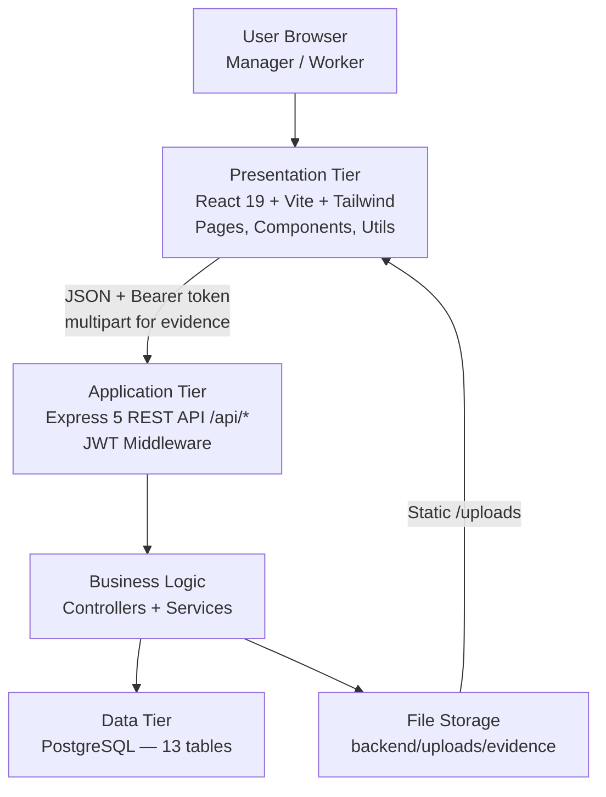
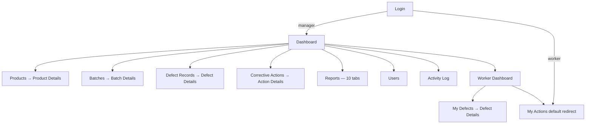
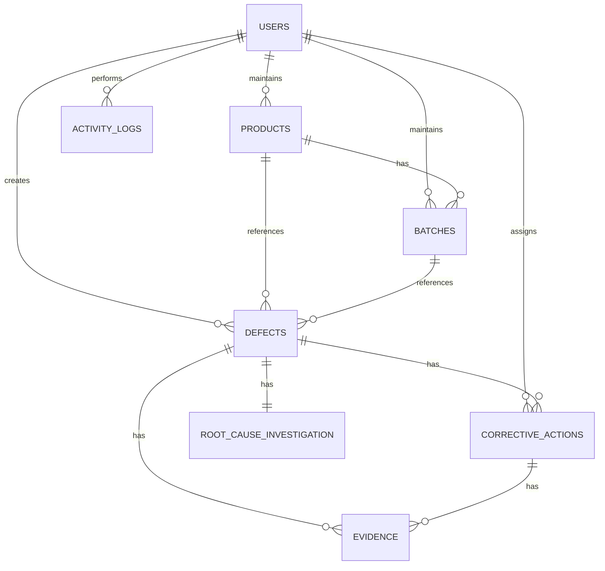
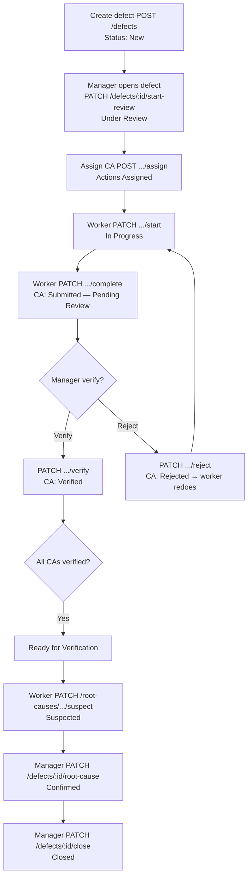

# QUALITY DEFECT TRACKING SYSTEM (QDTS) FOR KAK NORIE / RETORT NIAGA

**Project:** Prototype of a Web-Based Quality Defect Tracking System  
**Organization:** Kak Norie (Retort Niaga food manufacturing)  
**Platform:** React + Node.js + PostgreSQL  
**Document:** Chapters 1–4 (PSM I)

---

# CHAPTER 1: INTRODUCTION

## 1.1 Introduction

Kak Norie operates as a small-scale retort food manufacturing business producing shelf-stable pouch and bottled products (200g–250g) with a typical shelf life of twelve months. Quality problems such as incorrect expiry printing, loose sealing, and product spoilage are currently recorded using paper notebooks. This manual approach makes it difficult to trace defects back to production batches, monitor corrective actions, and produce management reports for loss and root cause analysis.

This project develops a **Quality Defect Tracking System (QDTS)** — a web-based application that digitises the defect lifecycle from worker reporting through manager review, corrective action assignment, verification, root cause confirmation, and closure. The system is grounded in primary data collected from Kak Norie's manager through WhatsApp communication (9 June 2026, Appendix C) and a structured Google Form questionnaire (11 June 2026, Appendix B), supported by literature on food quality management, traceability, and manufacturing analytics (Li et al., 2025; Lisitsyn et al., 2021; Puech et al., 2024).

The implemented prototype uses a three-tier architecture: React frontend, Express REST API, and PostgreSQL database. It supports two roles — **Manager** and **Worker** — with role-based dashboards, notifications, activity logging, expiry mismatch alerts, batch traceability, CSV export, and browser print / save-as-PDF summaries.

## 1.2 Problem Statement(s)

Based on WhatsApp clarification and the Google Form response from the manager (Nazhif, 11 June 2026) and observation of the existing manual process, the following problems directly motivate this project:

1. **Unstructured record keeping** — Defects are recorded *"dalam buku / kertas"* (in books/paper), making retrieval of historical cases slow and error-prone (Kak Norie, 2026).

2. **Corrective actions are not monitored** — The manager identified *"tindakan pembetulan tidak dipantau"* (corrective actions are not monitored), allowing the same problems to recur (Kak Norie, 2026).

3. **Recurring defects** — *"Masalah yang sama boleh berulang"* (the same problem can repeat) because root causes and completed actions are not systematically linked to batch and product history (Kak Norie, 2026; Puech et al., 2024).

4. **Expiry date traceability** — Although batch review is *"mudah"* (easy) manually, printed expiry on pouches can differ from the correct retort-based expiry. The Google Form response notes actions such as relabelling and mould changes, but there is no automated flag when **correct expiry ≠ printed expiry** (Kak Norie, 2026; Mariammal and Suresh, 2025).

5. **Loss and disposal not quantified in one system** — Loss is calculated from *"bilangan unit rosak sahaja"* (number of defective units only), but discarded quantity, relabelled quantity, and estimated financial loss are scattered across paper notes (Kak Norie, 2026; Barakat et al., 2025).

6. **Limited audit trail** — Records are needed for manager reference, worker reference, customer complaints, and inspections, but paper files lack timestamps and user accountability (Kak Norie, 2026; Yin and Wang, 2022).

7. **No role-based digital workflow** — Both manager and workers perform corrective work, yet verification before closure *"bergantung kepada jenis defect"* (depends on defect type). A system must enforce who reports, who acts, and who verifies (Kak Norie, 2026; Grino and Lasco, 2025).

## 1.3 Objective

The general objective is to design and implement a web-based Quality Defect Tracking System that supports structured defect recording, traceability, and reporting for Kak Norie.

Specific objectives:

- **O1** — To replace paper-based defect recording with a structured digital form linked to product and batch master data.
- **O2** — To implement a role-based workflow (Worker reports → Manager reviews → Assign corrective action → Worker completes → Manager verifies → Close defect).
- **O3** — To automate batch expiry validation (correct expiry from retort date + shelf life) and highlight expiry mismatches (Kak Norie, 2026; Mariammal and Suresh, 2025).
- **O4** — To track corrective actions with due dates, overdue alerts, evidence upload, and manager verification or rejection.
- **O5** — To calculate and report product loss from handled quantities and product loss rate per unit (Barakat et al., 2025).
- **O6** — To provide management reports (loss, root cause, expiry issues, batch expiry audit, by product, by batch) with CSV export and browser print / save-as-PDF summaries (Maryadi et al., 2025; Bhimanpallewar et al., 2024).
- **O7** — To maintain an activity log and per-defect timeline for audit and compliance (Lisitsyn et al., 2021).

## 1.4 Scope

**In scope:**

- **Users:** One manager and two workers (demo: nazhif, siti_aminah, hairul_nizam), expandable via users table.
- **Products:** Retort pouch and bottled products; categories, packaging, size, shelf life, loss rate.
- **Batches:** Production date, retort date, auto-generated batch number, correct vs printed expiry, quantity produced.
- **Defects:** Nine detection stages; defect types filtered by stage; evidence photos; quantity fields; status workflow.
- **Corrective actions:** Product handling and machine/process check types; assignment, start, complete, verify, reject, cancel; due date editing by manager.
- **Root cause:** Worker suspected cause and manager confirmation after investigation.
- **Reports & dashboards:** KPI cards, charts, expiry audit, CSV export, browser print summaries.
- **Platform:** Web browser on Windows PC; backend API port 3000; frontend port 5173; PostgreSQL database.

**Out of scope (v1):**

- AI/YOLO visual defect detection (Dhelia et al., 2024; Abu Mangshor et al., 2025).
- OCR label reading (Ibrahim and Tejaswi, 2024).
- Blockchain traceability (Chen et al., 2024; Xu et al., 2024).
- IoT smart warehouse (Gowrishankar et al., 2023).
- Email/SMS notifications (in-app bell only).
- Mobile native app (responsive web shell only).
- ERP integration.

**Reason for scope limits:** Kak Norie is a three-person operation; requirement gathering prioritised organised records, batch checking, loss recording, and corrective action tracking over advanced automation (Kak Norie, 2026).

## 1.5 Project Significance

| Stakeholder | Benefit |
|-------------|---------|
| **Manager (Nazhif)** | Dashboard KPIs, new-report alerts, overdue actions, expiry mismatch reports, verify/close workflow, export for audit |
| **Workers** | Simple defect reporting, clear action queue, overdue reminders, status visibility on own reports |
| **Kak Norie business** | Reduced recurrence through root cause logging; quantified loss; batch-level traceability for retort pouches |
| **Academic / PSM** | Demonstrates SDLC + OOAD applied to real SME food-quality problem with WhatsApp and Google Form primary data |

The project aligns with Quality 4.0 principles of digital quality information systems (Li et al., 2025) while remaining appropriate for micro-enterprise resources.

## 1.6 Expected Output

1. Working **QDTS** prototype (frontend + backend + database).
2. **PostgreSQL schema** with seed data representing Kak Norie products, batches, and sample defects.
3. **User documentation** (`DEMO.md`) and API smoke test script.
4. **This PSM report** (Chapters 1–4) with diagrams, requirements, and design aligned to the built system.
5. **Demonstration** of end-to-end flow: worker report → manager assign → worker complete → manager verify → close → reports update.

## 1.7 Conclusion

Chapter 1 introduced Kak Norie's manual quality recording problems and defined objectives for a focused defect tracking system. The next chapter reviews literature on food quality, traceability, analytics dashboards, and RBAC, and describes the SDLC methodology, requirements, and project schedule used to deliver QDTS.

---
# CHAPTER 2: LITERATURE REVIEW AND PROJECT METHODOLOGY

## 2.1 Introduction

This chapter presents the literature review and project methodology used in the development of the **Quality Defect Tracking System (QDTS)** for **Kak Norie / Retort Niaga**. It explains the research approach used to identify and confirm system requirements, discusses the project domain, reviews the existing system and related approaches, compares alternative techniques, and documents the Software Development Life Cycle (SDLC), project requirements, and project schedule.

The requirements for QDTS were developed using a combined research approach adapted from Bharosa et al. (2009). Bharosa et al. (2009) used **literature review**, **empirical case study**, and **semi-structured interviews** to identify and confirm information and system quality requirements in a multi-agency environment. Although the domain of that study differs from food manufacturing, the same three-step logic applies: literature review identifies general requirements, case investigation identifies context-specific problems, and stakeholder input confirms what the system must support.

This project **does not replicate semi-structured interviews**. It adapts Bharosa et al.’s logic using **WhatsApp communication** for initial consent and exploratory clarification, followed by a **structured Google Form questionnaire** and analysis of the current manual process at Kak Norie. Evidence is provided in **Appendix C** (WhatsApp, from 9 June 2026) and **Appendix B** (Google Form, 11 June 2026) respectively.

This project adapts that approach through three activities:

1. **Literature review** — to identify general quality-system requirements and suitable system features from published work on food quality management, defect tracking, traceability, CAPA, root cause analysis, expiry control, dashboards, and role-based access control.
2. **Current-system investigation / case study** — to examine the manual quality recording process at Kak Norie / Retort Niaga using WhatsApp clarification (Appendix C) and the Google Form response (*Kak Norie Quality Defect Tracking.csv*, 11 June 2026) as primary data.
3. **Requirement confirmation** — to consolidate WhatsApp and Google Form findings and translate them into QDTS requirements.

The findings from this chapter provide the foundation for the system analysis and design presented in Chapters 3 and 4.

---

## 2.2 Facts and Findings

### 2.2.1 Domain

Chapter 1 introduced the Kak Norie business context, problem statements, and project scope. This section focuses on the **research domain** and what the **literature review** contributes to QDTS requirement identification.

The project domain is **food quality management**, **defect tracking**, and **production traceability** in small-scale retort food manufacturing. In such environments, defects may arise across preparation, cooking, packing, sealing, retort, labelling, storage, and delivery. A digital quality system must therefore support stage-based defect capture, linked production records, corrective action follow-up, and management reporting—not only static data entry.

Published work reviewed for this project was grouped into six themes that inform QDTS design rather than repeat Chapter 1 problem statements:

**Table 2.1: Literature themes and relevance to QDTS**

| Theme | Representative source | Design implication for QDTS |
|-------|----------------------|----------------------------|
| Quality information systems / Quality 4.0 | Li et al. (2025) | Dashboard, digital workflow, structured records |
| Food quality and safety management | Lisitsyn et al. (2021) | Documented corrective action and audit support |
| Defect analytics and root cause | Puech et al. (2024) | Root cause module and analysis reports |
| Quality cost / loss measurement | Barakat et al. (2025) | Loss calculation and loss reporting |
| Traceability | Yin and Wang (2022) | Product and batch linkage in defect records |
| Expiry control concepts | Mariammal and Suresh (2025) — retail barcode/QR expiry alerts | Expiry mismatch comparison (**concept adapted, not identical domain**) |
| Access control | Grino and Lasco (2025) — LGU employee RBAC system | Manager/worker role separation (**concept adapted, not identical domain**) |

Cooling occurs in the real production process after retort, but QDTS does **not** treat Cooling as a separate detected stage; related issues may be recorded under stages such as **Retort Process** or **Stock Storage**, or through root cause and process/tool fields.

The purpose of the literature review in this chapter is to identify **general** system requirements and evaluate alternative techniques before they are combined with Kak Norie primary data in Sections 2.2.2 and 2.2.3.

---

### 2.2.2 Existing System

#### A. Existing system at Kak Norie / Retort Niaga

Chapter 1 (Section 1.2) states the problems that motivate QDTS. This section does **not** repeat that list. Instead, it summarises the **as-is quality recording process** confirmed from primary data (WhatsApp communication, Appendix C; structured Google Form response, Appendix B).

The current approach is **manual**: defects are noted in paper records (*“dalam buku / kertas”*), follow-up is partly informal, and there is no central digital system for search, workflow, or audit.

**Table 2.2: As-is practices confirmed from primary data**

| Area | Current practice (Kak Norie) | Implication for QDTS |
|------|------------------------------|----------------------|
| Record format | Paper notebook / notes | Need structured digital defect records |
| Search and history | No central searchable archive; respondent requested easier search of old records (*“Senang cari semula rekod lama”*) | Need indexed search and history |
| Batch identification | No formal batch number on every production (*“Tidak”*) | Need batch master data in system |
| Corrective action monitoring | *“Tindakan pembetulan tidak dipantau”* | Need CA assignment and status tracking |
| Defect recurrence | *“Masalah yang sama boleh berulang”* | Need root cause and history linkage |
| Expiry / label control | Manual review reported as *“Ya, mudah”*; no digital mismatch alert; no reported printed/correct expiry difference at response time (*“Tidak”*) | Need central expiry record and mismatch flag |
| Loss recording | Based on defective units only (*“bilangan unit rosak sahaja”*) | Need consolidated loss fields and reports |
| Accountability | Paper lacks timestamps and user trail | Need activity log and role-based actions |
| Roles | Manager and workers both handle corrective work; closure depends on defect type | Need manager/worker workflow rules |

The manager’s most recently reported practical defect example in the form was **loose sealing** (*“Sealing tidak rapat”*) at **Packing** and **Sealing** stages. These as-is findings confirm that Kak Norie needs a focused digital system rather than a full enterprise platform.

#### B. Related systems and approaches from literature

Literature and industry practice describe several approaches to quality and defect management:

**Spreadsheet / Excel tracking**  
Spreadsheets can record defects and calculate losses at low cost. However, they provide limited workflow control, weak audit trails, poor role separation, and difficulty in linking defects to batches and corrective actions over time.

**CAPA / Quality Management Systems (QMS)**  
CAPA-oriented systems support corrective action assignment, investigation, verification, and root cause analysis. Full CAPA or enterprise QMS platforms are powerful but may be too complex or costly for a three-person SME operation.

**ERP systems**  
ERP platforms can integrate production, inventory, quality, and reporting. However, they are typically expensive, require significant configuration, and are not practical for a small retort food business at the current scale.

**Manufacturing defect tracking systems**  
Manufacturing quality systems support defect logging, action tracking, analytics, and reporting. These systems align closely with the needs identified at Kak Norie, especially when implemented at SME-appropriate scope.

**Traceability systems**  
Traceability systems link products and batches to incidents and support audit and recall-related review. This is relevant because Kak Norie needs to trace defects to specific batches and expiry records.

**Table 2.3: Related approaches and relevance to QDTS**

| Approach | Finding | Relevance to QDTS |
|----------|---------|-------------------|
| QMIS / Quality 4.0 (Li et al., 2025) | Digital platforms integrate inspection, corrective action, and reporting | Supports dashboard and workflow design |
| Defect root cause analytics (Puech et al., 2024) | Structured data improves root cause analysis | Supports root cause module and reports |
| BI dashboards (Bhimanpallewar et al., 2024; Maryadi et al., 2025) | KPI dashboards improve visibility | Supports manager dashboard |
| Food traceability (Yin and Wang, 2022) | Batch-level trace links production to incidents | Supports batch detail and expiry audit |
| Expiry alert systems (Mariammal and Suresh, 2025) | Retail barcode/QR expiry alert concept | Supports expiry mismatch alerts — **concept adapted for batch expiry comparison, not identical domain** |
| RBAC (Grino and Lasco, 2025) | RBAC in a local-government employee system | Supports manager/worker roles — **role-separation concept adapted, not identical domain** |
| Vision AI / YOLO (Abu Mangshor et al., 2025) | Automated packaging defect detection | Not adopted — scope and cost |
| Blockchain traceability (Xu et al., 2024) | Tamper-proof distributed records | Not adopted — SME overhead |

QDTS adopts **selected concepts** from CAPA and manufacturing defect tracking, but not a full enterprise CAPA, ERP, or AI-based inspection system.

---

### 2.2.3 Technique

Several techniques can be used to manage quality defects and production problems. Table 2.4 compares **operational alternatives** for Kak Norie on suitability criteria, not maximum feature count.

**Table 2.4: Comparison of quality recording alternatives for Kak Norie**

| Criterion | Manual paper | Excel / spreadsheet | Google Form only | CAPA / QMS | ERP | **QDTS (selected)** |
|-----------|--------------|---------------------|------------------|------------|-----|---------------------|
| Initial cost | Very low | Low | Low | High | Very high | Low (prototype) |
| Training effort | Low | Medium | Low | High | High | Medium |
| Role separation (manager/worker) | Informal | Weak | None | Strong | Strong | **Implemented (2 roles)** |
| Workflow status tracking | None | Manual columns | None | Strong | Strong | **Implemented** |
| Batch + expiry linkage | Manual | Manual setup | Not for operations | Yes | Yes | **Yes (manual batch entry)** |
| Expiry mismatch alert | None | Formula only | None | Possible | Possible | **Implemented** |
| CA verify / reject | Informal | Informal | None | Strong | Strong | **Implemented** |
| Root cause history | Paper notes | Columns | One-time survey | Strong | Strong | **1:1 investigation record** |
| Reports / CSV export | None | Basic | Response export only | Strong | Strong | **10 report tabs + CSV** |
| Audit trail | Weak | Weak | None | Strong | Strong | **Workflow activity log** |
| Fit for 3-person SME | Familiar but limited | Possible but fragile | Wrong tool type | Over-scoped | Over-scoped | **Best fit for scope** |

Table 2.4 compares six operational alternatives against eleven suitability criteria. The alternatives excluded from this matrix (AI inspection, OCR, blockchain) are out of scope as stated in Chapter 1.4; they were not treated as day-to-day recording options for Kak Norie.

QDTS is selected because it is the only option that combines structured defect workflow, batch traceability, role-based access, and reporting without ERP-level cost. Section 2.2.2 B already describes each alternative in narrative form; Table 2.4 provides the structured comparison that supports the selection.

#### Selected technique

The selected technique is a **web-based three-tier Quality Defect Tracking System (QDTS)** with:

- **Presentation layer:** React, Vite, and Tailwind CSS
- **Application layer:** Node.js and Express REST API with JWT authentication
- **Data layer:** PostgreSQL relational database
- **Workflow model:** simplified **CAPA-oriented** defect and corrective action workflow
- **Access control:** Manager and Worker roles

This approach is suitable for Kak Norie because it is:

- **Practical** — matches the current size of the operation and daily workflow
- **Affordable** — uses open-source/web technologies without ERP, AI, or blockchain cost
- **Role-aware** — separates manager review/verification from worker reporting/action completion
- **Traceable** — links defects to product, batch, expiry, and corrective actions
- **Reportable** — supports loss, root cause, expiry, and batch/product analysis
- **Auditable** — maintains activity logs and structured records
- **Demonstrable** — can run on localhost for academic prototype evaluation

Kak Norie operates with one manager and two workers. Primary data showed that the manager’s priority is **organised defect records**, **batch checking**, **loss recording**, and **corrective action follow-up**, not advanced automation. QDTS digitises the notebook process without ERP adoption. It supports reported defect contexts (expiry printing, sealing) through stage-based reporting, expiry mismatch flags, and root cause confirmation. The prototype uses CSV export and browser print/save-as-PDF, not native server PDF or email alerts.

QDTS is **not** a full CAPA system, full ERP, AI inspection system, OCR label reader, or blockchain platform. It is a focused defect tracking prototype for SME quality record keeping and monitoring.

---

## 2.3 Project Methodology

### Research approach

Following the adapted Bharosa et al. (2009) logic, requirements were identified and confirmed through:

| Step | Method | Purpose in QDTS project | Output |
|------|--------|------------------------|--------|
| 1 | Literature review | Identify general quality-system requirements and suitable features | Requirement themes for QDTS |
| 2 | Case / current-system investigation | Understand Kak Norie manual process and context-specific problems | Problem statements and as-is process description |
| 3 | WhatsApp + structured Google Form | Consolidate initial and structured findings from manager (Nazhif) | Confirmed functional requirements for QDTS |

Primary data sources (in collection order):

1. WhatsApp communication with the manager (Nazhif) from **9 June 2026** onwards — **Appendix C** (initial contact, consent, exploratory clarification)
2. Structured Google Form questionnaire completed on **11 June 2026** — **Appendix B** (main structured primary data source)

Requirement gathering followed the sequence **WhatsApp first, then Google Form**. WhatsApp established contact and informed the questionnaire scope. The Google Form is the **main structured primary data source** for as-is process, defect types, reporting needs, and expected system support.

#### Relationship between research approach and SDLC

Table 2.5 below follows **SDLC phase order**, which differs slightly from the conceptual order in the research table above. In practice:

- **Phase 1 (Requirement Gathering)** began with WhatsApp communication (9 June 2026), followed by the structured Google Form (11 June 2026).
- **Phase 2 (Literature Review)** ran after initial case data were collected and in parallel with early analysis reading.
- **Phase 3 (System Analysis)** consolidated WhatsApp and Google Form findings, literature themes, and confirmed requirements into the requirement specification in Chapter 3.

Thus, primary data collection started first, literature supported requirement validation and technique selection, and full requirement consolidation occurred before detailed design.

### Software Development Life Cycle (SDLC)

After requirements were identified and confirmed, the system was developed using a **modified waterfall SDLC** with **Object-Oriented Analysis and Design (OOAD)** for module structure, class/entity modelling, and database design. Phases were completed in sequence from requirement gathering through final submission. Minor refinements to UI layout, export behaviour, and role permissions were made during development and testing when prototype review revealed gaps; these refinements stayed within the development and testing phases rather than restarting the full lifecycle.

**Table 2.5: SDLC phases, activities, outputs, and relation to QDTS**

| Phase | Activities | Outputs | Relation to QDTS |
|-------|------------|---------|------------------|
| 1. Requirement Gathering | WhatsApp communication (initial contact, 9 June 2026); structured Google Form questionnaire (11 June 2026); review of business process and product/batch practices | WhatsApp evidence (Appendix C); Google Form CSV (Appendix B); initial requirement list | Defines what QDTS must support at Kak Norie |
| 2. Literature Review | Review articles on quality management, traceability, CAPA, dashboards, RBAC, expiry control | Literature summary; requirement themes; technique comparison | Supports design decisions and justifies selected features |
| 3. System Analysis | Analyse manual process; define as-is/to-be flow; identify functional and non-functional requirements | Use case summary; DFD; problem analysis; requirement specification (Chapter 3) | Translates findings into system requirements |
| 4. System Design | Design architecture, UI, database ERD, workflows, navigation, API modules | Architecture diagram; ERD; UI design; workflow design (Chapter 4) | Blueprint for implementation |
| 5. System Development | Implement frontend pages, backend controllers/services, PostgreSQL schema and seed data | Working QDTS prototype modules | Real system aligned with Kak Norie workflow |
| 6. Testing | Smoke test, API integration test, manual demo script, role-based access verification | Test results; demo checklist; screenshot evidence | Verifies system behaviour before submission |
| 7. Documentation | Prepare DEMO.md, diagrams, screenshots, PSM report, user/system documentation | Report chapters; appendices; demo guide | Supports evaluation and viva |
| 8. Final Submission | Finalize report, prototype, appendices, and presentation materials | Completed PSM submission package | Final deliverable |

#### Phase details

**Phase 1: Requirement Gathering**  
Activities began with WhatsApp communication for consent and initial clarification (9 June 2026, Appendix C), followed by a structured Google Form questionnaire completed on 11 June 2026 (Appendix B). The investigation focused on current record keeping, defect types, expiry printing problems, batch practices, loss recording, corrective actions, reporting needs, and user roles.

**Phase 2: Literature Review**  
Published work on food quality systems, traceability, CAPA, dashboards, and RBAC was reviewed to identify general system requirements and evaluate alternative techniques.

**Phase 3: System Analysis**  
The manual process was analysed and compared with the proposed digital workflow. Functional requirements, non-functional requirements, and data requirements were defined based on WhatsApp and Google Form findings and literature support.

**Phase 4: System Design**  
The three-tier architecture, user interface, database structure, and workflow logic were designed. QDTS supports nine detected stages, manager/worker roles, corrective action lifecycle, root cause investigation, and reporting modules.

**Phase 5: System Development**  
QDTS was implemented as a web-based system with modules for authentication, products, batches, defects, corrective actions, root cause, dashboards, reports, activity log, evidence upload, and user management.

**Phase 6: Testing**  
Testing included backend smoke testing, API integration testing, manual workflow testing using DEMO.md, and verification of manager/worker permissions.

**Phase 7: Documentation**  
Documentation included technical files, PSM diagrams, screenshots, and report writing.

**Phase 8: Final Submission**  
All project deliverables were compiled for final evaluation.

---

## 2.4 Project Requirements

### 2.4.1 Software Requirement

The software requirements for developing and demonstrating QDTS are as follows:

- Microsoft Windows 10/11
- Visual Studio Code / Cursor IDE
- Node.js and npm
- React
- Vite
- Tailwind CSS
- Express.js
- PostgreSQL
- pgAdmin / DBeaver
- Git / GitHub
- Google Chrome
- Postman / Thunder Client
- Draw.io / diagrams.net
- Microsoft Word

These tools support coding, database management, API testing, diagram creation, version control, and report preparation.

### 2.4.2 Hardware Requirement

The hardware requirements for development and prototype demonstration are:

- Laptop or desktop computer
- Intel Core i5 processor or equivalent
- Minimum 8 GB RAM
- Minimum 256 GB storage
- Internet connection for literature access, repository work, and reference materials
- Localhost demo environment for prototype execution

The prototype runs locally using:

- Frontend: `http://localhost:5173`
- Backend API: `http://localhost:3000`

External hosting is not required for PSM prototype demonstration.

### 2.4.3 Other Requirements

Other requirements for completing the project include:

- Kak Norie Google Form questionnaire response (*Kak Norie Quality Defect Tracking.csv*) — **Appendix B**
- WhatsApp communication evidence with the manager (Nazhif) — **Appendix C**
- Sample product, batch, and defect data for demonstration
- Supervisor feedback and guidance
- Testing and demo environment
- Documentation and diagram tools
- PSM appendices for Gantt chart, requirement gathering evidence, and screenshots

---

## 2.5 Project Schedule and Milestones

Table 2.6 presents the **planned project schedule** for April to June 2026. It follows the SDLC phases described in Section 2.3 and is intended as a milestone plan for the PSM period, not a claim that every phase was completed exactly on the dates shown unless supported by Appendix A or project logs.

**Table 2.6: Planned project schedule and milestones**

| Phase | Activity | Duration | Output |
|-------|----------|----------|--------|
| 1 | Requirement gathering (WhatsApp + Google Form) | 2 weeks | Confirmed problem list and initial requirements |
| 2 | Literature review | 2 weeks | Literature summary and requirement themes |
| 3 | System analysis | 2 weeks | Requirement specification and as-is/to-be analysis |
| 4 | System design | 2 weeks | Architecture, ERD, UI, and workflow design |
| 5 | System development | 5 weeks | Working QDTS prototype |
| 6 | Testing | 2 weeks | Test results and demo verification |
| 7 | Documentation | 2 weeks | DEMO.md, diagrams, screenshots, report drafts |
| 8 | Final submission | 1 week | Final report and presentation package |

**Total planned duration:** 18 weeks (April–June 2026)

A detailed planned Gantt chart is presented in **Appendix A**.

---

## 2.6 Conclusion

This chapter established the **research and development framework** for QDTS. It adapted Bharosa et al.’s three-step logic using literature review, Kak Norie case investigation, and primary data collection beginning with WhatsApp communication (Appendix C) and continuing with a structured Google Form questionnaire (Appendix B).

From the literature, seven themes were mapped to QDTS design implications (Table 2.1). Primary data summarised the as-is manual process without repeating Chapter 1 problem statements (Table 2.2). Technique comparison showed that a web-based three-tier QDTS is the most suitable option for a three-person SME, while advanced automation remains out of scope as stated in Chapter 1.4 (Table 2.4).

The chapter also documented the modified waterfall SDLC with OOAD (Table 2.5), software/hardware/other requirements, and the planned April–June 2026 schedule (Table 2.6). Chapter 3 will translate these findings into formal system analysis and confirmed requirements.

---

## REFERENCES USED IN CHAPTER 2

All entries below were verified against Crossref (June 2026) or the ISCRAM Digital Library. DOIs resolve to the stated title and authors.

Bharosa, N., van Zanten, B., Appelman, J. and Zuurmond, A. (2009) 'Identifying and confirming information and system quality requirements for multi-agency disaster management', in *Proceedings of the 6th International Conference on Information Systems for Crisis Response and Management (ISCRAM 2009): Boundary Spanning Initiatives and New Perspectives*, Gothenburg, Sweden, 10–13 May. Available at: https://idl.iscram.org/show.php?record=891 (Accessed: 17 June 2026).

Kak Norie (2026) *Quality defect tracking questionnaire response (Google Form)*. Respondent: Nazhif (Manager). Available at: *Kak Norie Quality Defect Tracking.csv* (Accessed: 11 June 2026).

Li, J., Xu, Y., Wang, H., Swatdikun, T., Li, X. and Chen, J. (2025) 'The development of quality management information system under quality 4.0 era: a review', in *2025 8th International Symposium on Big Data and Applied Statistics (ISBDAS)*, pp. 473–478. DOI: 10.1109/ISBDAS64762.2025.11116953.

Lisitsyn, A.B., Nikitina, M.A. and Chernukha, I.M. (2021) 'Product quality and safety management in large-scale systems', in *2021 14th International Conference on Management of Large-Scale System Development (MLSD)*. DOI: 10.1109/MLSD52249.2021.9600217.

Puech, L., Dupuis, A., Dadouchi, C. and Pellerin, R. (2024) 'Applied data analytics approach for defect root causes analysis in manufacturing: the case of multi-product assembly lines', in *2024 IEEE 48th Annual Computers, Software, and Applications Conference (COMPSAC)*. DOI: 10.1109/COMPSAC61105.2024.00044.

Barakat, O., Elassimi, T. and Bouhsain, I. (2025) 'Digital cost of quality management in Moroccan agri-food firms: adoption insights and benefits', in *2025 IEEE International Conference on Advanced Technologies in Supply Chain Management (ATSCM)*. DOI: 10.1109/ATSCM67505.2025.11473424.

Mariammal, G. and Suresh, S. (2025) 'Real-time expiry alert system for safer retail using barcode and QR code recognition', in *2025 6th International Conference on Intelligent Communication Technologies and Virtual Mobile Networks (ICICV)*. DOI: 10.1109/ICICV64824.2025.11085659.

Grino, F.M., Abellar, J.P., Cagmat, R. and Lasco, C.F. (2025) 'A secure role-based access control framework for employee plantilla management system in the local government unit of Magallanes, Agusan del Norte', in *2025 International Conference on Emerging Technologies and Innovation for Sustainability (EmergIN)*. DOI: 10.1109/EmergIN67762.2025.11450678.

Yin, X. and Wang, B. (2022) 'Edible fungi quality and safety traceability management system', in *2022 Global Conference on Robotics, Artificial Intelligence and Information Technology (GCRAIT)*. DOI: 10.1109/GCRAIT55928.2022.00177.

Bhimanpallewar, R., Jagtap, D., Raut, V. and Tonge, S. (2024) 'OEE dashboard using data analytics', in *2024 4th Asian Conference on Innovation in Technology (ASIANCON)*. DOI: 10.1109/ASIANCON62057.2024.10838144.

Maryadi, D., Singgih, M.L. and Dewi, D.S. (2025) 'Integrating Lean Six Sigma indicators into business intelligence systems: a systematic review across sectors and metrics', in *2025 9th International Conference on Information Technology, Information Systems and Electrical Engineering (ICITISEE)*. DOI: 10.1109/ICITISEE68184.2025.11355031.

Abu Mangshor, N.N., Ahmad Tahiruddin, A.M., Aminuddin, R., Abdul Jalil, U.M., Sheng, C.C. and Ibrahim, S. (2025) 'Application of lightweight YOLOv8 variants for defect detection and classification in canned food packaging', in *2025 IEEE 16th Control and System Graduate Research Colloquium (ICSGRC)*, pp. 149–154. DOI: 10.1109/ICSGRC65918.2025.11159707.

Xu, Y., He, P., Sheng, P. and Li, N. (2024) 'Design and implementation of a blockchain-based food traceability system', in *2024 4th International Symposium on Computer Technology and Information Science (ISCTIS)*. DOI: 10.1109/ISCTIS63324.2024.10698760.

Chen, G.-H., Liu, Y. and Yang, J. (2024) 'Food safety traceability technology and application based on blockchain', in *2024 International Conference on Industrial IoT, Big Data and Supply Chain (IIoTBDSC)*. DOI: 10.1109/IIoTBDSC64371.2024.00087.

Gowrishankar, V., Veena, P., Ponmurugan, P., Annapoorani, B.T., Vijayakumar, P. and Siva Ramkumar, M. (2023) 'Edge computing enabled smart warehouse management system for food processing industries', in *2023 14th International Conference on Computing Communication and Networking Technologies (ICCCNT)*, pp. 1–7. DOI: 10.1109/ICCCNT56998.2023.10308398.

Ibrahim, S.P., Karthikeyan, L., Bhoomika, P., Tejaswi, K., Khande, L.S. and Vemishetti, N.S. (2024) 'Automating nutritional claim verification: the role of OCR and machine learning in enhancing food label transparency', in *2024 International Conference on IoT Based Control Networks and Intelligent Systems (ICICNIS)*, pp. 1164–1171. DOI: 10.1109/ICICNIS64247.2024.10823177.

Dhelia, A., Chordia, S. and B, K. (2024) 'YOLO-based food damage detection: an automated approach for quality control in food industry', in *2024 8th International Conference on I-SMAC (IoT in Social, Mobile, Analytics and Cloud) (I-SMAC)*. DOI: 10.1109/I-SMAC61858.2024.10714664.
---
# CHAPTER 3: ANALYSIS

## 3.1 Introduction

Chapter 2 established the research approach, literature themes, Kak Norie as-is practices, selected technique, and SDLC framework for the **Quality Defect Tracking System (QDTS)**. This chapter translates those findings into formal **system analysis and requirements** for the **implemented QDTS prototype**.

The analysis phase addresses three questions:

1. What are the weaknesses of the **current manual process** at Kak Norie?
2. What **data**, **functions**, and **quality attributes** must QDTS support?
3. How do the confirmed requirements correspond to the **modules actually built** in React, Express, and PostgreSQL?

All requirements in Section 3.3 are based only on the running system: `schema.sql`, API routes and controllers, React pages, role access rules, report modules, and demo seed data (`seed.sql`, `seed_demo_timeline.sql`). Wording in this chapter uses **QDTS** (not internal version names) and describes exports as **CSV** and **browser print/save-as-PDF**, because the prototype does not generate native PDF files.

Chapter 4 will present system design. This chapter focuses on analysis only.

---

## 3.2 Problem Analysis

### 3.2.1 Current System Scenario

Chapter 1 (Section 1.2) and Chapter 2 (Table 2.2) summarise the manual process confirmed from WhatsApp communication (Appendix C) and the Google Form response (Appendix B). At Kak Norie today:

**Manual paper recording**  
Defects are recorded in a notebook (*“dalam buku / kertas”*). Records are not indexed, searchable, or linked to a central product or batch master.

**No formal batch numbering on every production**  
The form response to *“Adakah setiap production mempunyai batch number?”* was **“Tidak”**. Production history is therefore difficult to trace in a consistent coded format on paper.

**Manager and worker involvement**  
The manager (Nazhif) and workers both handle quality-related work (*“Pengurus dan pekerja”*), but there is no digital rule for who reports, who acts, who verifies, and who closes a case.

**Defect handling**  
When a quality issue is found (for example **loose sealing** at **Packing / Filling** or **Sealing**, as reported in the form), the team may segregate stock, relabel, discard, or adjust equipment. These steps are not tracked through a structured workflow with statuses.

**Corrective action monitoring**  
The manager reported *“tindakan pembetulan tidak dipantau”*. Due dates, completion, and verification are not centrally monitored, which supports the form finding *“Masalah yang sama boleh berulang”*.

**Loss recording**  
Loss is currently based on *“bilangan unit rosak sahaja”*. Relabelled, discarded, on-hold, and estimated financial loss are not consolidated in one auditable record.

**Expiry checking**  
Manual review of batch and expiry for wrong-print scenarios was reported as *“Ya, mudah”*, but there is no centralized digital record or automatic mismatch alert. Printed expiry had not been reported as different from correct expiry at response time (*“Tidak”*).

**Reporting limitations**  
The manager requested reports such as loss, corrective actions, and root causes. Paper records cannot produce filtered KPIs, charts, CSV exports, printable summaries, or user-timestamped audit trails.

---

### 3.2.2 Current Process Flow

The **real production flow** at Kak Norie is:

**Ingredient preparation → Cooking → Packing → Sealing → Retort → (Cooling) → Labelling → Storage → delivery / customer**

**Cooling** occurs after retort in actual production but is **not** a detected stage in QDTS. It is mentioned here only as real process context.

When a quality issue is detected, the **manual quality sub-process** is:

1. Issue found during or after production  
2. Problem written in a paper notebook  
3. Manager or worker informed informally  
4. Immediate physical action (discard, relabel, machine adjustment, hold stock)  
5. Loss noted manually (usually defective units only)  
6. No structured root cause link to product history  
7. No centralized report or audit log  

**Figure 3.1 — Current activity flow (recommended diagram)**

| Step | Activity | Actor | Output |
|------|----------|-------|--------|
| 1 | Ingredient preparation | Worker | Prepared ingredients |
| 2 | Cooking | Worker | Cooked product |
| 3 | Packing / filling | Worker | Filled packs |
| 4 | Sealing | Worker | Sealed packs |
| 5 | Retort process | Worker | Retorted packs |
| 6 | Cooling (real process only) | Worker | Cooled packs |
| 7 | Labelling / expiry printing | Worker | Labelled stock |
| 8 | Stock storage | Worker/Manager | Stored inventory |
| 9 | Detect quality issue | Worker/Manager | Problem identified |
| 10 | Write in notebook | Worker/Manager | Paper defect note |
| 11 | Inform manager/worker verbally | Both | Informal decision |
| 12 | Take corrective action | Worker/Manager | Physical action |
| 13 | Record loss manually | Worker/Manager | Partial loss note |
| 14 | File paper — no central search | — | Weak traceability |

**Figure 3.2 — Current sequence diagram (recommended narrative)**

1. **Worker** detects a defect during packing, sealing, labelling, storage, or delivery.  
2. **Worker** writes product name, approximate date, and quantity in a notebook.  
3. **Worker** informs the **Manager** verbally.  
4. **Manager** decides corrective action without formal system assignment.  
5. **Worker/Manager** performs the action on the production floor.  
6. **Manager** may note loss on paper.  
7. Completion is not verified in a system; similar defects may recur.  
8. **Manager** cannot easily produce loss or root cause summaries from paper files.

*Diagram sources in project:* `PSM/diagrams/figure-3-1-current-manual-defect-handling-activity.png`, `PSM/diagrams/figure-3-2-current-manual-defect-handling-sequence.png`, `PSM/diagrams/figure-3-3-qdts-use-case.png`, `PSM/diagrams/figure-3-4-proposed-qdts-workflow-activity.png`

---

### 3.2.3 Problem Analysis

**Table 3.1: Chapter 1 problem statements — cause, impact, and QDTS solution**

| # | Problem (Ch. 1) | Cause (manual process) | Impact | QDTS solution (implemented) |
|---|-----------------|------------------------|--------|----------------------------|
| P1 | Unstructured record keeping | Paper notebook only | Slow search; incomplete history | Digital defect records linked to product and batch master |
| P2 | Corrective actions not monitored | No assignment or status tracking | Actions forgotten | CA workflow: Assigned → In Progress → Submitted — Pending Review → Verified / Rejected / Cancelled |
| P3 | Recurring defects | Root cause not linked to history | Same problems repeat | Root cause investigation + root cause reports + batch/defect history |
| P4 | Expiry traceability gaps | No digital compare of printed vs correct expiry; no formal batch no. on every run | Weak label audit | **New batch master** in QDTS; auto `correct_expiry_date`; mismatch alerts; Expiry Issues and Batch Expiry Audit reports |
| P5 | Loss not quantified in one system | Loss = defective units only on paper | Cannot total disposal cost | Quantity fields + `estimated_loss`; Loss report KPIs |
| P6 | Limited audit trail | Paper lacks user/time trail | Weak accountability | `activity_logs` + defect activity timeline + Activity Log page |
| P7 | No role-based digital workflow | Informal shared responsibilities | Unclear verify/close roles | JWT roles; manager-only routes; worker scoped access |

**Note on batch numbering (P4):** The Google Form response mentioned a format such as `(product)-B-001`. QDTS implements **`{product_code}-B-{YYYYMMDD}`** from retort date when a manager creates a batch. This is a **new digital capability**; it replaces the current absence of formal batch numbers on every production.

---

## 3.3 Requirement Analysis

All requirements below exist in the **current implemented prototype**. No unimplemented features are included.

### 3.3.1 Data Requirement

#### Input data

| Data area | Key inputs | Source / validation |
|-----------|------------|---------------------|
| **User** | username, email, full_name, role, password | Login; manager Add User form |
| **Product** | product_name, product_code, category, packaging_type, size_weight, shelf_life_months, loss_rate_per_unit, storage_condition, product_status | Manager product form |
| **Batch** | product_id, production_date, retort_date, printed_expiry_date, quantity_produced, notes | Manager batch form; `retort_date ≥ production_date` |
| **Defect** | product_id, batch_id, detected_at_stage, defect_type, problem_level, description, qty_affected, optional handling quantities, evidence, review_due_date (manager) | Worker 2-step report or manager 3-step report; qty ≤ batch quantity |
| **Corrective Action** | action_type, task, assigned_to, due_date, priority, completion quantities, evidence | Manager assign; assigned worker complete |
| **Root Cause** | suspected fields (worker) or confirmed fields (manager) | One investigation row per defect |
| **Evidence** | image file, evidence_note | Defect or CA upload |

#### Output data

| Output | Description | Module |
|--------|-------------|--------|
| **Dashboard KPIs** | Defect, loss, action, expiry, and chart summaries | `GET /reports/dashboard/summary` |
| **Reports** | Ten manager report tabs | `GET /reports/*` |
| **Notifications** | In-app bell only (no email/SMS) | `NotificationsPanel` |
| **CSV export** | Downloadable table data from reports/lists | `TableExportActions`, `ListCsvExport` |
| **Print summary** | Browser print/save-as-PDF for reports and defect/CA summaries | `reportExport.js`, `defectExport.js`, `correctiveActionExport.js` |

#### Stored data — thirteen entities

| # | Table | Purpose |
|---|-------|---------|
| 1 | `users` | Accounts and roles |
| 2 | `products` | Product master |
| 3 | `batches` | Production and expiry records |
| 4 | `defect_types` | Defect type catalogue |
| 5 | `defect_type_mappings` | Stage-to-type rules |
| 6 | `defect_workflow_rules` | Default level/priority by type |
| 7 | `defect_workflow_options` | Suggested handling options |
| 8 | `root_causes` | Master root cause list |
| 9 | `defects` | Defect cases |
| 10 | `root_cause_investigation` | Investigation per defect |
| 11 | `corrective_actions` | Assigned tasks |
| 12 | `evidence` | Upload metadata |
| 13 | `activity_logs` | Audit trail |

#### Key business rules and calculations (implemented)

QDTS applies automatic calculations and validation checks when managers create batches, when workers or managers report defects, and when corrective actions are completed. Table 3.8 summarises the main rules in plain language. Selected rules are explained further in the paragraphs after the table.

**Table 3.8: Key business rules and calculations (implemented)**

| Rule | Implementation |
|------|----------------|
| Batch number | The system automatically generates a batch number using the product code and retort date when the manager creates a batch (format: `{product_code}-B-{YYYYMMDD}`). |
| Batch date validation | The retort date cannot be earlier than the production date. |
| Correct expiry date | The correct expiry date is calculated from the retort date and the product shelf life in months. |
| Expiry mismatch | If the correct expiry date is different from the printed expiry date, the batch is marked as defective and an alert is shown. If both dates match, the batch is marked as approved. |
| Expiry difference | The system calculates the difference between the correct expiry date and printed expiry date in days for reporting purposes. |
| Affected quantity limit | The affected quantity cannot be more than the batch quantity produced. |
| Handled quantity limit | The total handled quantity (relabelled, repacked, reworked, released, discarded, and on hold) cannot be more than the affected quantity. |
| Initial quantity on hold | When a defect is reported, all affected units are initially placed on hold. |
| Still sellable quantity | The system calculates still sellable units from relabelled, repacked, reworked, and released quantities. |
| Remaining quantity on hold | After handling actions are recorded, the system calculates the remaining quantity still on hold. |
| Loss rate | The loss rate is taken from the product record when the defect is reported and stored on the defect for historical accuracy. |
| Corrective action loss | When a worker completes a product-handling corrective action, the system calculates loss based on **discarded quantity only** and the product loss rate. |
| Defect estimated loss | The defect estimated loss is updated by adding the loss from each completed product-handling corrective action. |
| Loss status | The loss status shows whether the defect has **no financial loss**, **loss recorded but case still open**, or **loss confirmed at closure** (see explanation below). |
| Potential loss | For open defects, the system estimates potential loss based on quantity on hold and product loss rate for reporting purposes only. |
| Confirm root cause | The manager can confirm the root cause only after all non-cancelled corrective actions have been verified. |
| Close defect | A defect can be closed only when the root cause is confirmed and all non-cancelled corrective actions are verified. |

**Explanation of selected rules**

**Batch and expiry rules (rows 1–5).** Kak Norie did not use a formal batch number on every production run before QDTS. The system therefore creates a readable batch code when the manager enters production and retort dates. The correct expiry date is computed automatically so the manager can compare it with the printed expiry on the label. This supports the expiry printing problems reported in the Google Form. The expiry difference in days is used mainly in the Expiry Issues and Batch Expiry Audit reports, not for daily workflow by itself.

**Quantity rules (rows 6–10).** When a defect is reported, the worker or manager enters how many units are affected. This value cannot exceed the quantity produced for that batch. At first, all affected units are treated as on hold because no handling action has been recorded yet. When a worker completes a product-handling corrective action, the system records how many units were relabelled, repacked, reworked, released, or discarded. Units that can still be sold are counted as still sellable. Any affected units not yet handled remain on hold. The system blocks data entry if the total handled quantity exceeds the affected quantity.

**Loss rules (rows 11–14).** The loss rate comes from the product master data (for example, estimated cost per damaged unit). Financial loss is calculated from **discarded units only**, not from relabelled or repacked units that can still be recovered. Each completed corrective action stores its own loss value; the defect record keeps a running total called estimated loss. Potential loss is different: it is an estimate for **open** defects where units are still on hold, and it appears in the Loss report as a warning figure before the case is closed.

**Loss status — three values (row 14).** Loss status is separate from estimated loss. Estimated loss is a **number** (RM value from discarded units). Loss status is a **label** that tells the manager whether financial loss applies and whether it is final. QDTS uses three values:

| Loss status (system value) | Meaning | When it is set | Example at Kak Norie |
|----------------------------|---------|----------------|----------------------|
| **No loss** | No units were discarded for this defect | `qty_discarded = 0` — for example after relabelling only | Wrong expiry label fixed by relabelling 120 packs; no stock thrown away |
| **Pending review** | Units were discarded and loss is recorded, but the defect is **not closed yet** | Worker completes a corrective action with discarded quantity while the case is still open | 20 leaking pouches discarded; manager still needs to verify the action and close the case |
| **Loss confirmed** | Discarded units exist and the defect is **closed** | Manager closes the defect after verification when `qty_discarded > 0` | Closed case with 4 loose-seal units discarded; estimated loss is treated as confirmed in Loss reports |

The status changes automatically when handling quantities are updated and when the manager closes the defect. On a new defect report, the status starts as **No loss** because no corrective action has been completed yet. After a worker records discarded units in a completed corrective action, the status becomes **Pending review** if the defect remains open. When the manager closes the defect and discarded units exist, the status becomes **Loss confirmed** and the system may record a loss confirmed date. If the defect is closed with zero discarded units, the status remains **No loss** even after closure.

This design supports Kak Norie’s need to record loss from damaged units (*“bilangan unit rosak”*) while keeping open cases clearly marked as not yet final. The Loss report uses **Loss confirmed** (and closed defects) for confirmed totals, and **Potential loss** (row 15) for units still on hold in open cases.

**Workflow rules (rows 15–16).** Root cause confirmation and defect closure are separate steps. The manager must verify corrective actions first so that handling quantities and loss values are final. Only then can the manager confirm the root cause and close the defect. This order prevents a case from being closed before corrective work is properly checked.

**Table 3.8** therefore shows that QDTS uses automatic calculations for batch traceability, expiry checking, quantity control, and loss reporting, while workflow rules ensure that closure happens only after verification and root cause confirmation.

#### Recommended references

- **Figure 3.3** — Context diagram / Context DFD Level 0 (`PSM/diagrams/dfd-as-is-level0-context.mmd`)  
- **Figure 3.4** — ERD core entities (`PSM/diagrams/erd-qdts-core.svg`)  
- **Data dictionary** — Field definitions (Appendix or Chapter 4 database section)

**Table 3.2: Data requirement summary**

| ID | Category | I/O | Description | Entity |
|----|----------|-----|-------------|--------|
| DR-01 | User | In, stored | Authentication identity | `users` |
| DR-02 | Product | In, stored | SKU, shelf life, loss rate | `products` |
| DR-03 | Batch | In, stored | Production record with auto batch no. | `batches` |
| DR-04 | Defect | In, stored | Quality case linked to batch | `defects` |
| DR-05 | Stage/type rules | Stored | Valid types per detected stage | `defect_type_mappings` |
| DR-06 | Corrective action | In, stored | Task and completion data | `corrective_actions` |
| DR-07 | Root cause | In, stored | Suspected/confirmed investigation | `root_cause_investigation` |
| DR-08 | Evidence | In, stored | Photo file metadata | `evidence` |
| DR-09 | Activity log | Out, stored | Audit entries | `activity_logs` |
| DR-10 | Dashboard KPI | Out | Aggregated metrics | Report queries |
| DR-11 | Report rows | Out | Analytical datasets | Report queries |
| DR-12 | Notification | Out | In-app alert items | Frontend aggregation |
| DR-13 | CSV export | Out | Downloadable tables | Frontend export |
| DR-14 | Print summary | Out | Browser print layout | Frontend print utils |

---

### 3.3.2 Functional Requirement

#### Detected stages (nine — implemented)

1. Ingredient Preparation  
2. Cooking  
3. Packing / Filling  
4. Sealing  
5. Retort Process  
6. Labelling / Expiry Printing  
7. Stock Storage  
8. Before Delivery  
9. After Customer Receives Product  

Cooling is **not** a detected stage.

#### Workflow statuses (system display labels)

**Defect workflow**

New → Under Review → Actions Assigned → In Progress → Ready for Verification → Closed

**Corrective action workflow**

Assigned → In Progress → Submitted — Pending Review → Verified / Rejected / Cancelled

**Root cause workflow**

Pending Investigation → Suspected → Confirmed

*Note:* The database stores snake_case values (for example `ready_verification`, `completed`). The labels above are the **user-facing statuses** shown in QDTS. Workers may see **Work Assigned** instead of **Actions Assigned** on their own defect view.

#### Primary API paths for root cause (implemented)

| Action | Actor | API |
|--------|-------|-----|
| Submit suspected root cause | Worker | `PATCH /root-causes/defects/:defectId/suspect` |
| Confirm root cause | Manager | `PATCH /defects/:id/root-cause` |

**Table 3.3: Functional requirements (implemented)**

| ID | Module | Function | Actor | Input | Output |
|----|--------|----------|-------|-------|--------|
| FR-01 | Authentication | Login | Manager, Worker | username, password | JWT session |
| FR-02 | Authentication | View current user | Manager, Worker | token | `/auth/me` profile |
| FR-03 | User Management | List active users | Manager | optional role filter | User list |
| FR-04 | User Management | Add new user | Manager | username, email, name, role, password | New active user |
| FR-05 | Product Management | List/view products | Manager, Worker | — | Product records |
| FR-06 | Product Management | Create product | Manager | product fields | New product |
| FR-07 | Product Management | Update product | Manager | product fields | Updated product |
| FR-08 | Product Management | Archive product | Manager | product id | `product_status = archived` |
| FR-09 | Batch Management | List/view batches | Manager, Worker | — | Batch records |
| FR-10 | Batch Management | Create batch | Manager | dates, printed expiry, qty | Auto batch no. + correct expiry |
| FR-11 | Batch Management | Update batch | Manager | batch fields | Updated batch |
| FR-12 | Batch Management | View linked defects/CAs | Manager, Worker | batch id | Related records |
| FR-13 | Defect Management | Report defect (worker) | Worker | 2-step form + evidence | Status **New** |
| FR-14 | Defect Management | Create/report defect (manager) | Manager | 3-step form + evidence | Status **New** |
| FR-15 | Defect Management | List defects (scoped) | Manager (all), Worker (own/assigned) | filters | Defect list |
| FR-16 | Defect Management | View defect details | Manager, Worker | defect id | Detail + expiry alert |
| FR-17 | Defect Management | Start review | Manager | defect id | **Under Review** |
| FR-18 | Defect Management | Update defect | Manager | fields, review due date | Updated defect |
| FR-19 | Defect Management | Upload defect evidence | Manager, Worker (with access) | file | Evidence row |
| FR-20 | Defect Management | View defect activity | Manager, Worker (with access) | defect id | Timeline |
| FR-21 | Corrective Action | Assign action | Manager | type, task, assignee, due date | **Assigned**; defect **Actions Assigned** |
| FR-22 | Corrective Action | List actions (scoped) | Manager (all), Worker (assigned) | filters | CA list |
| FR-23 | Corrective Action | Start action | Worker (assignee) | action id | **In Progress** |
| FR-24 | Corrective Action | Complete action | Worker (assignee) | quantities, notes, evidence | **Submitted — Pending Review**; defect **Ready for Verification** |
| FR-25 | Corrective Action | Verify action | Manager | action id | **Verified** |
| FR-26 | Corrective Action | Reject action | Manager | reason | **Rejected** |
| FR-27 | Corrective Action | Cancel rejected action | Manager | action id | **Cancelled** |
| FR-28 | Corrective Action | Edit due date | Manager | new date | Updated due date |
| FR-29 | Corrective Action | Upload CA evidence | Worker (assignee) | file | Evidence row |
| FR-30 | Root Cause | View investigation | Manager, Worker (with access) | defect id | Investigation record |
| FR-31 | Root Cause | Submit suspected cause | Worker | source, cause, tool | **Suspected** |
| FR-32 | Root Cause | Confirm root cause | Manager | confirmed fields | **Confirmed** |
| FR-33 | Defect Management | Close defect | Manager | defect id | **Closed** (rules enforced) |
| FR-34 | Dashboard | Manager dashboard | Manager | period filter | KPIs, charts, latest defects |
| FR-35 | Dashboard | Worker dashboard | Worker | — | My actions, my defects, alerts |
| FR-36 | Reports | View and export reports | Manager | period filter | Tables, CSV, browser print |
| FR-37 | Activity Log | View activity log | Manager | search/filter | Log entries |
| FR-38 | Notifications | View in-app notifications | Manager, Worker | — | Bell panel |
| FR-39 | Workflow rules | Load stages/types/options | Manager, Worker | stage or type | Form dropdown data |

**User management scope:** FR-03 and FR-04 are the **only** implemented user-admin functions. There is no edit-user, deactivate-user, or delete-user screen in the prototype.

**Product scope:** FR-08 archives a product; there is **no delete product** function.

**Reports scope (FR-36):** Ten tabs — Overview (includes recent corrective actions via `/reports/corrective-actions`), Loss, Root Cause, By Detection Stage, Root Cause Area, Process / Tool, Expiry Issues (defect cases + batch expiry audit), Discarded Products, By Product, By Batch.

#### Recommended diagrams

- **Figure 3.5** — Use Case Diagram (`PSM/diagrams/use-case-qdts.svg`)  
- **Appendix** — Use case descriptions for Report Defect, Assign CA, Complete CA, Verify CA, Confirm Root Cause, Close Defect

---

### 3.3.3 Non-Functional Requirement

**Table 3.4: Non-functional requirements**

| ID | Category | Requirement | Description | Justification |
|----|----------|-------------|-------------|---------------|
| NFR-01 | Security | Authentication | JWT on protected API routes | `requireAuth` |
| NFR-02 | Security | Password protection | bcrypt password hash | `users.password_hash` |
| NFR-03 | Security | Role-based access | Manager vs worker operations | `requireManager`, `requireWorker`, access checks |
| NFR-04 | Security | Route guard | Workers blocked from manager pages | `RequireRole`, `MANAGER_ONLY_PREFIXES` |
| NFR-05 | Performance | Local response | Acceptable load on demo seed (~55 defects) | Smoke/API tests on localhost |
| NFR-06 | Availability | Prototype hosting | Frontend `:5173`, API `:3000`, local PostgreSQL | PSM demo |
| NFR-07 | Usability | Role-based UI | Separate manager dashboard and worker queue | `Dashboard.jsx` |
| NFR-08 | Usability | Status labels | Defect, CA, and root cause labels as listed in §3.3.2 | `StatusBadge`, `caStatusLabel` |
| NFR-09 | Usability | Feedback states | Loading and empty states | Shared UI components |
| NFR-10 | Reliability | Transactions | Assign, complete, close use DB transactions | Controller `BEGIN/COMMIT` |
| NFR-11 | Reliability | Data integrity | FK chain product → batch → defect → CA | PostgreSQL constraints |
| NFR-12 | Maintainability | Layered code | Routes, controllers, services | Express structure |
| NFR-13 | Maintainability | Shared utilities | Expiry, loss, due date, export helpers | `utils/` modules |
| NFR-14 | Auditability | Activity log | Major actions logged | `activity_logs` |
| NFR-15 | Auditability | Retention | No hard delete of defects/batches; product archive only | Schema design |
| NFR-16 | Compatibility | Browser | Modern browser for React SPA | Chrome/Edge demo |
| NFR-17 | Export | CSV and print | CSV download; print via browser (not native PDF engine) | Export components |

---

### 3.3.4 Other Requirements

#### Software stack (implemented)

| Component | Purpose |
|-----------|---------|
| React + Vite + Tailwind CSS | Web interface |
| Node.js + Express | REST API |
| PostgreSQL | Data storage |
| JWT + bcrypt | Authentication |
| Multer | Evidence upload |

#### Hardware and tools

Refer to Chapter 2 Section 2.4 for hardware minimums (Windows 10/11, Core i5, 8 GB RAM, 256 GB storage) and development tools (VS Code/Cursor, pgAdmin/DBeaver, Git, Postman/Thunder Client, Draw.io, Chrome, Word).

The prototype is demonstrated on **localhost**; external production hosting is out of scope.

---

## 3.4 Conclusion

Problem analysis shows that Kak Norie’s manual notebook process cannot support structured defect recording, corrective action monitoring, formal batch traceability, consolidated loss reporting, or auditability. QDTS addresses these gaps through a web-based prototype with nine detected stages, role-based workflows, thirteen database entities, manager reports, in-app notifications, CSV export, and browser print/save-as-PDF summaries.

Requirement analysis documents only implemented functions, including **view/add users** (not full user administration), **product archive** (not delete), **manager and worker defect reporting**, and **auto-generated batch numbers** as a new digital capability. Chapter 4 will present the detailed system design based on these requirements.

---

## FINAL LIST — DIAGRAMS FOR CHAPTER 3

| Figure | Title | Section | Source / action |
|--------|-------|---------|-----------------|
| 3.1 | Current Activity Diagram (As-Is Manual Process) | 3.2.2 | `PSM/diagrams/flowchart-as-is-current-process.svg` |
| 3.2 | Current Sequence Diagram (Manual Defect Handling) | 3.2.2 | Draw from §3.2.2 narrative |
| 3.3 | Context Diagram / Context DFD Level 0 | 3.3.1 | `PSM/diagrams/dfd-as-is-level0-context.mmd` |
| 3.4 | Entity Relationship Diagram (Core Entities) | 3.3.1 | `PSM/diagrams/erd-qdts-core.svg` |
| 3.5 | Use Case Diagram (Manager and Worker) | 3.3.2 | `PSM/diagrams/use-case-qdts.svg` |

---

## FINAL LIST — TABLES FOR CHAPTER 3

| Table | Title | Section |
|-------|-------|---------|
| 3.1 | Problem analysis — cause, impact, QDTS solution | 3.2.3 |
| 3.2 | Data requirement summary | 3.3.1 |
| 3.3 | Functional requirements (FR-01 to FR-39) | 3.3.2 |
| 3.4 | Non-functional requirements (NFR-01 to NFR-17) | 3.3.3 |
| 3.5 | Current activity flow steps (Figure 3.1 narrative) | 3.2.2 |
| 3.6 | Input data summary | 3.3.1 |
| 3.7 | Stored entities (thirteen tables) | 3.3.1 |
| 3.8 | Key business rules and calculations | 3.3.1 |
| 3.9 | Software stack | 3.3.4 |
| 3.10 | Defect / CA / root cause workflow labels | 3.3.2 |
| 3.11 | Root cause API paths | 3.3.2 |
| 3.12 | Manager report tabs and API endpoints (optional appendix) | 3.3.2 |
| 3.13 | Role access summary (optional appendix) | 3.3.2 |

**Optional appendix tables (recommended before submission):**

- Use case descriptions (UC-01 to UC-06)  
- Requirement traceability matrix (Chapter 1 objectives O1–O7 → FR IDs)  
- Data dictionary for core tables
---
# CHAPTER 4: DESIGN

## 4.1 Introduction

Chapter 3 defined the analysis and requirements for the **Quality Defect Tracking System (QDTS)** implemented as a web prototype for Kak Norie / Retort Niaga. This chapter presents the **system design** that satisfies those requirements: architecture, user interface, database logical model, software modules, and physical database implementation.

All design descriptions in this chapter are based on the **running prototype** only—`frontend/src/`, `backend/src/`, and `backend/database/schema.sql`. The system name used throughout is **QDTS** (not internal version labels). Export outputs are **CSV download** and **browser print / save-as-PDF** via the print dialog; the prototype does **not** generate native PDF or Excel files on the server.

Software and hardware platform choices are documented in Chapter 2 (Section 2.4). Functional requirements, workflow labels, and thirteen stored entities are documented in Chapter 3 (Section 3.3). This chapter focuses on **how** those requirements are designed and structured in the implemented system.

---

## 4.2 High-Level Design

### 4.2.1 System Architecture

QDTS adopts a **three-tier client–server architecture**: a React single-page application (presentation tier), an Express REST API (application tier), and PostgreSQL with local file storage for evidence (data tier). There is no microservice layer, message broker, or separate authentication server.

**Figure 4.1 — Three-tier system architecture**



**Table 4.1 — Architecture layers and responsibilities**

| Layer | Location | Responsibility |
|-------|----------|----------------|
| Presentation | `frontend/src/` | Routing, forms, dashboards, reports, notifications, role-based UI |
| API gateway | `backend/src/routes/index.js` | Route mounting, `requireAuth` after login |
| Authentication | `middleware/auth.js` | JWT sign/verify (8-hour session) |
| Access control | `utils/accessControl.js` | Manager/worker guards, worker data scoping |
| Controllers | `controllers/*.js` | HTTP handlers, transactions, activity logging |
| Services | `services/*.js` | Batch expiry, defect rules, loss calculation, root cause confirmation |
| Data | `database/schema.sql` | Relational storage, CHECK constraints, indexes |
| File storage | `uploads/evidence/` | Evidence images (JPG/PNG/WEBP, max 5 MB) |

**Table 4.2 — Technology stack (implemented)**

| Tier | Technology | Role |
|------|------------|------|
| Frontend | React 19, Vite 8, Tailwind CSS, React Router, Axios, Recharts | SPA UI |
| Backend | Node.js, Express 5, jsonwebtoken, bcrypt, Multer, pg | REST API |
| Database | PostgreSQL | Persistent data |
| Development | localhost `:5173` (frontend), `:3000` (API) | Prototype demo |

Full version and tool lists are in Chapter 2 (Table 2.5).

**Workflow statuses (system display labels)**

Defect workflow (Chapter 3, Table 3.10):

**New → Under Review → Actions Assigned → In Progress → Ready for Verification → Closed**

Corrective action workflow:

**Assigned → In Progress → Submitted — Pending Review → Verified / Rejected / Cancelled**

*(Database value `completed` is displayed as **Submitted — Pending Review** in the UI.)*

Root cause workflow:

**Pending Investigation → Suspected → Confirmed**

Defect status is **automatically updated** when corrective actions change (`refreshDefectStatus()` in `correctiveActionController.js`).

---

### 4.2.2 User Interface Design

The QDTS interface is a responsive web application with a **left sidebar** (collapsible on desktop, hamburger menu on mobile), top header with notification bell, and role-specific menus defined in `AppShell.jsx`. Workers who navigate to manager-only URLs are redirected to **My Actions** (`/corrective-actions`) by `RequireRole.jsx`.

#### (a) Navigation Design

**Manager menu:** Dashboard, Products, Batches, Defect Records, Corrective Actions, Reports, Users, Activity Log.

**Worker menu:** Dashboard, My Defects, My Actions.

**Figure 4.2 — Navigation flow**

*Diagram file:* `PSM/diagrams/navigation-flow-qdts.svg`



**Deep links (implemented):**

| URL | Behaviour |
|-----|-----------|
| `/reports?tab=expiry` | Opens Reports tab **Expiry Issues** |
| `/corrective-actions?filter=overdue` | Filters overdue actions (legacy param; `?caDue=overdue` also supported) |
| `/defects/:id?tab=root-cause` | Opens Defect Details **Root Cause** tab |

**Table 4.3 — Page inventory**

| Page | Route | Role | Purpose |
|------|-------|------|---------|
| Login | (pre-auth) | All | Authenticate with username and password |
| Dashboard | `/` | Both | Role-specific KPIs, charts, attention lists |
| Products | `/products` | Manager | Product catalogue; add/edit/archive |
| Product Details | `/products/:id` | Manager | Single product with batches and defects |
| Batches | `/batches` | Manager | Batch register; add/edit |
| Batch Details | `/batches/:id` | Manager | Batch traceability, linked defects and CAs |
| Defect Records / My Defects | `/defects` | Both | Defect list; report/add defect |
| Defect Details | `/defects/:id` | Both | Overview, Actions, Root Cause, Activity tabs |
| Corrective Actions / My Actions | `/corrective-actions` | Both | CA register with filters and CSV export |
| Corrective Action Details | `/corrective-actions/:id` | Both | Start, complete, verify, reject, evidence |
| Reports | `/reports` | Manager | Ten analytical tabs with period filter |
| Users | `/users` | Manager | Active user list; add user only |
| Activity Log | `/activity-log` | Manager | Paginated audit trail with CSV/print |

**Table 4.4 — Navigation controls**

| Control | Location | Function |
|---------|----------|----------|
| Sidebar link | Left panel | Primary module navigation |
| Hamburger menu | Top header (mobile) | Open/close sidebar |
| Notification bell | Top header | Deep links to overdue CAs, new defects, expiry mismatches |
| KPI card | Dashboard | Drill-down to filtered lists |
| Tab pills | Reports, Defect Details | Switch sub-views |
| Row action button | Tables | Open detail pages |

**Recommended screenshots**

| Figure | Title | File (capture to `PSM/screenshots/`) |
|--------|-------|--------------------------------------|
| 4.3 | Manager sidebar | `fig-4-3-manager-sidebar.png` |
| 4.4 | Worker sidebar | `fig-4-4-worker-sidebar.png` |

---

#### (b) Input Design

Input screens use text fields, number fields, date pickers, dropdowns, text areas, and file upload controls. **Client-side** validation runs before submit; **server-side** validation in controllers enforces business rules and role permissions.

**Login uses username and password** (not email login). Email is stored on user records but is not the login identifier.

**Defect reporting — two flows**

| Actor | Steps | Form labels |
|-------|-------|-------------|
| Worker | 2 steps: What & Where → Details & Photo | **Report Defect** |
| Manager | 3 steps: Product Information → Defect Information → Evidence & Initial Suggestions | **Add Defect** |

**Table 4.5 — Input fields and validation rules**

| Screen / Form | Field | Type | Required? | Validation / business rule |
|---------------|-------|------|-----------|----------------------------|
| Login | Username | Dropdown (demo) / text | Yes | Active user; bcrypt password verify |
| Login | Password | Password | Yes | Required |
| Add User | Username | Text | Yes | `[a-z0-9_]+`; unique |
| Add User | Email | Email | Yes | Valid format; unique |
| Add User | Full name | Text | Yes | Non-empty |
| Add User | Role | Select | Yes | `manager` or `worker` |
| Add User | Password | Password | Yes | Minimum 6 characters |
| Add User | Account status | Select | No | `active` or `inactive`; default active |
| Add / Edit Product | Product name | Text | Yes | Non-empty |
| Add / Edit Product | Category, packaging, size | Dropdown | Yes | Predefined lists |
| Add / Edit Product | Shelf life (months) | Number | Yes | > 0 |
| Add / Edit Product | Loss rate per unit | Number | Yes | ≥ 0 |
| Add / Edit Product | Storage condition | Dropdown | No | Optional on server |
| Add / Edit Product | Description | Text area | No | Optional |
| Add / Edit Product | Product code | Read-only | — | Auto-generated on create; not editable |
| Add / Edit Batch | Product | Dropdown | Yes | Must exist |
| Add / Edit Batch | Production date | Date | Yes | Required |
| Add / Edit Batch | Retort date | Date | Yes | ≥ production date |
| Add / Edit Batch | Printed expiry date | Date | Yes | Compared to system correct expiry |
| Add / Edit Batch | Quantity produced | Number | Yes | > 0 |
| Add / Edit Batch | Notes | Text area | No | Optional |
| Report Defect Step 1 | Product, batch | Dropdown | Yes | Batch must belong to product |
| Report Defect Step 1 | Detected stage | Dropdown | Yes | One of nine stages (Section 3.3.2) |
| Report Defect Step 1 | Defect type | Dropdown | Yes | Filtered by stage; validated against `defect_type_mappings` |
| Report Defect Step 1 | Defect type other | Text | If type = Other | Required when Other selected |
| Report Defect Step 1 | Qty affected | Number | Yes | > 0 and ≤ batch quantity produced |
| Report Defect Step 2 | Description | Text area | Yes | Non-empty |
| Report Defect Step 2 | Priority | Select | Yes | If `urgent`, urgency reason required |
| Report Defect Step 2 | Review due date | Date | No | Cannot be before today if set |
| Report Defect Step 2 | Photo evidence | File | No | JPG/PNG/WEBP ≤ 5 MB; uploaded after create |
| Add Defect Step 3 (manager) | Suggested product handling | Dropdown | Yes | From workflow rule options |
| Add Defect Step 3 (manager) | Suggested machine handling | Dropdown | Yes | From workflow rule options |
| Add Defect Step 3 (manager) | Related tool / machine | Dropdown | Yes | From workflow rule options |
| Add Defect Step 3 (manager) | Handling notes | Text area | No | Optional |
| Assign Corrective Action | Action type | Dropdown | Yes | `product_handling` or `machine_process_check` |
| Assign Corrective Action | Task | Dropdown / custom text | Yes | From rule options or Custom Task |
| Assign Corrective Action | Assigned to | Dropdown | Yes | Active worker user |
| Assign Corrective Action | Due date | Date | No | Editable later by manager |
| Assign Corrective Action | Evidence required | Checkbox | No | Blocks complete/verify without upload |
| Assign Corrective Action | Priority | Dropdown | No | Default `medium` on server |
| Complete Corrective Action | Investigation finding | Text area | Yes | Non-empty |
| Complete Corrective Action | Action taken | Text area | Yes | Non-empty |
| Complete Corrective Action | Handling quantities | Number | No | Each ≥ 0; **cumulative handled ≤ qty affected** |
| Complete Corrective Action | Evidence file | File | If required | At least one image when `evidence_required` |
| Reject Corrective Action | Rejection reason | Text area | Yes | Manager only |
| Suspected Root Cause | Suspected cause | Dropdown | Yes | Worker with defect access |
| Suspected Root Cause | Investigation notes | Text area | No | Optional |
| Confirm Root Cause | Confirmed cause | Dropdown | Yes | Manager; all CAs must be verified first |
| Edit CA due date | Due date | Date | Yes | Blocked if defect closed or CA verified |

**Recommended screenshots (input forms)**

| Figure | Title | File |
|--------|-------|------|
| 4.5 | Login form | `fig-4-5-login.png` |
| 4.6 | Add product form | `fig-4-6-add-product.png` |
| 4.7 | Add batch form | `fig-4-7-add-batch.png` |
| 4.8 | Report defect form (worker) | `fig-4-8-report-defect-worker.png` |
| 4.9 | Assign corrective action | `fig-4-9-assign-action.png` |

---

#### (c) Output Design

QDTS outputs include on-screen summaries, detail lists, charts, audit logs, CSV downloads, and printable HTML summaries (browser print / save-as-PDF).

**Table 4.6 — Output design classification**

| Output | Description | Type | Frequency |
|--------|-------------|------|-----------|
| Dashboard (manager) | KPI cards, defect trend chart, actions by status, attention centre | Summary / graph | On-demand; default period this month |
| Dashboard (worker) | My reports, assigned actions, overdue alerts | Summary | On-demand |
| Defect list | Filterable table with status badges | Detail list | On-demand; CSV export |
| Defect details | Tabs: overview, actions, root cause, activity; print summary | Detail | On-demand |
| Corrective action list | Filterable table; CSV export | Detail list | On-demand |
| Batch / product details | Traceability and linked records | Detail | On-demand |
| Reports (10 tabs) | Loss, root cause, expiry, by product/batch, etc. | Analytical | On-demand; period filter |
| Batch expiry audit | All batches where printed ≠ correct expiry | Audit report | On-demand |
| Activity log | Paginated user actions | Audit | On-demand; CSV and print |
| In-app notifications | Bell panel (max 8 items shown) | Alert | Evaluated on page load |
| Print summary | Defect or CA case summary | Turnaround document | On-demand; browser print |
| Export CSV | Report or list download | Turnaround document | On-demand |

Reports tabs (implemented in `Reports.jsx`): Overview, Loss, Root Cause, By Detection Stage, Root Cause Area, Process / Tool, Expiry Issues, Discarded Products, By Product, By Batch.

**Recommended screenshots (output)**

| Figure | Title | File |
|--------|-------|------|
| 4.10 | Manager dashboard | `fig-4-10-dashboard-manager.png` |
| 4.11 | Defect list | `fig-4-11-defect-list.png` |
| 4.12 | Defect details | `fig-4-12-defect-details.png` |
| 4.13 | Reports page | `fig-4-13-reports.png` |
| 4.14 | Activity log | `fig-4-14-activity-log.png` |

---

### 4.2.3 Database Design

#### 4.2.3.1 Conceptual and Logical Database Design

The logical data model (LDM) describes what data the system stores and how entities relate. The physical schema defines **thirteen tables** (Chapter 3, Table 3.7). The **core transactional ERD** in this section shows **eight entities**; lookup and configuration tables (`defect_types`, `defect_type_mappings`, `root_causes`, `defect_workflow_rules`, `defect_workflow_options`) support dropdowns and validation but are omitted from the core diagram for readability. The full ERD is in `PSM/diagrams/erd-qdts-full.svg`.

**Figure 4.15 — Core logical ERD**

*Diagram file:* `PSM/diagrams/erd-qdts-core-report.svg`



**Table 4.7 — Entity relationships and business rules**

| Parent | Child | Cardinality | FK | Business rule |
|--------|-------|-------------|-----|---------------|
| `products` | `batches` | 1 : M | `batches.product_id` | Each batch belongs to one product; correct expiry = retort date + product shelf life |
| `products` | `defects` | 1 : M | `defects.product_id` | Defect linked to product for reporting; names joined at query time |
| `batches` | `defects` | 1 : M | `defects.batch_id` | Defect tied to one batch; batch dates not duplicated on defect row |
| `defects` | `root_cause_investigation` | 1 : 1 | `defect_id` UNIQUE | Row created at defect report; status Pending → Suspected → Confirmed |
| `defects` | `corrective_actions` | 1 : M | `corrective_actions.defect_id` | Multiple CAs per defect; ON DELETE CASCADE |
| `defects` | `evidence` | 1 : M | `evidence.defect_id` | Optional defect-level photos |
| `corrective_actions` | `evidence` | 1 : M | `evidence.corrective_action_id` | CA completion evidence |
| `users` | `defects` | 1 : M | `created_by`, `closed_by` | Accountability for report and closure |
| `users` | `corrective_actions` | 1 : M | `assigned_to`, `assigned_by`, etc. | Separation of assign, execute, verify |
| `users` | `activity_logs` | 1 : M | `activity_logs.user_id` | Append-only audit trail |

**Design decisions**

1. **Batch owns dates and quantity** — production, retort, correct/printed expiry, and quantity produced live on `batches` only.
2. **Product owns shelf life and loss rate** — `loss_rate_per_unit` may be copied to `defects` as a snapshot at report time.
3. **Defect type as text** — `defects.defect_type` stores the type name; `defect_type_mappings` validates stage combinations on insert.
4. **Root cause deferred** — investigation is 1:1 in `root_cause_investigation`, not overloaded on `defects`.
5. **Products archive only** — no delete API; preserves traceability.

**Table 4.8 — Data dictionary (core columns)**

| Table | Key columns | Notes |
|-------|-------------|-------|
| `users` | `id` PK, `username` UNIQUE, `email` UNIQUE, `role`, `account_status`, `password_hash` | Login by username |
| `products` | `id` PK, `product_code` UNIQUE, `shelf_life_months`, `loss_rate_per_unit`, `product_status` | Code auto-generated |
| `batches` | `id` PK, `batch_number` UNIQUE, `product_id` FK, `retort_date`, `correct_expiry_date`, `printed_expiry_date`, `quantity_produced` | Batch number `{code}-B-{YYYYMMDD}` |
| `defects` | `id` PK, `defect_code` UNIQUE, `product_id`, `batch_id`, `detected_at_stage`, `defect_type`, `defect_status`, `qty_affected` | Nine stages; no Cooling stage |
| `root_cause_investigation` | `id` PK, `defect_id` UNIQUE FK, `root_cause_status`, suspected/confirmed fields | Worker suspect; manager confirm |
| `corrective_actions` | `id` PK, `action_code` UNIQUE, `defect_id` FK, `ca_status`, `assigned_to`, `due_date`, `calculated_loss` | Includes `cancelled` status |
| `evidence` | `id` PK, `defect_id`, `corrective_action_id`, `file_name`, `uploaded_by` | Metadata; files on disk |
| `activity_logs` | `id` PK, `user_id`, `action_type`, `entity_type`, `entity_id`, `description` | e.g. START_REVIEW, CLOSE_DEFECT |

Full column definitions are in `backend/database/schema.sql`.

**Normalization**

All thirteen tables satisfy **Third Normal Form (3NF)**: atomic columns, single-column surrogate primary keys, and foreign keys instead of redundant descriptive fields. Controlled denormalization: `defects.loss_rate_per_unit` snapshots the product rate at report time for historical loss accuracy.

---

## 4.3 Detailed Design

### 4.3.1 Software Design

Request flow: **Route → Controller → Service (optional) → PostgreSQL**. Mutating operations use **BEGIN/COMMIT** transactions where multiple tables must stay consistent (create defect, assign CA, confirm root cause, close defect).

**Figure 4.16 — Defect lifecycle activity flow**



**Table 4.9 — API route catalogue**

| Module | Method | Path | Role | Purpose |
|--------|--------|------|------|---------|
| Health | GET | `/api/health` | Public | API status |
| Auth | POST | `/api/auth/login` | Public | Issue JWT |
| Auth | GET | `/api/auth/me` | Auth | Current user |
| Products | GET/POST | `/api/products` | Read: all; Write: manager | List / create |
| Products | GET/PUT | `/api/products/:id` | Read: all; Write: manager | Detail / update |
| Products | PATCH | `/api/products/:id/archive` | Manager | Archive product |
| Batches | GET/POST | `/api/batches` | Read: all; Write: manager | List / create |
| Batches | GET/PUT | `/api/batches/:id` | Manager write | Detail / update |
| Batches | GET | `/api/batches/:id/defects`, `.../corrective-actions` | Auth | Batch traceability |
| Defects | GET/POST | `/api/defects` | Auth | List (worker scoped) / create |
| Defects | GET | `/api/defects/rules/*`, `/options/*` | Auth | Stages, types, workflow rules |
| Defects | GET/PATCH | `/api/defects/:id`, `start-review`, `root-cause`, `close` | Mixed | Detail, review, confirm RC, close |
| Defects | POST | `/api/defects/:id/evidence` | Auth | Upload defect evidence |
| Defects | GET | `/api/defects/:id/activity` | Auth | Per-defect timeline |
| Corrective actions | GET | `/api/corrective-actions` | Auth | List (worker scoped) |
| Corrective actions | POST | `/api/corrective-actions/defects/:defectId/assign` | Manager | Assign CA |
| Corrective actions | PATCH | `/api/corrective-actions/:id/start` | Worker | Start CA |
| Corrective actions | PATCH | `/api/corrective-actions/:id/complete` | Worker | Submit completion |
| Corrective actions | PATCH | `/api/corrective-actions/:id/verify`, `reject`, `cancel` | Manager | Verify / reject / cancel |
| Corrective actions | PATCH | `/api/corrective-actions/:id/due-date` | Manager | Edit due date |
| Corrective actions | POST | `/api/corrective-actions/:id/evidence` | Worker (assigned) | Upload CA evidence |
| Root causes | GET | `/api/root-causes/defects/:defectId` | Auth | Get investigation |
| Root causes | PATCH | `/api/root-causes/defects/:defectId/suspect` | Worker | Record suspected RC |
| Root causes | PATCH | `/api/root-causes/defects/:defectId/confirm` | Manager | Confirm RC (alternate path) |
| Reports | GET | `/api/reports/*` (11 endpoints) | Manager | Dashboard summary, loss, expiry, etc. |
| Users | GET/POST | `/api/users` | Manager | List active users / add user |
| Activity logs | GET | `/api/activity-logs` | Manager | Paginated audit log |

**Table 4.10 — Controllers and services**

| Module | File | Purpose |
|--------|------|---------|
| `authController` | Login, session user | JWT + bcrypt |
| `userController` | List users, create user | Manager-only; no edit/deactivate UI |
| `productController` | CRUD, archive, auto product code | Manager write |
| `batchController` | CRUD, batch defects/CAs, expiry meta | Manager write |
| `defectController` | Defect CRUD, rules, review, RC confirm, close, evidence | Core workflow |
| `correctiveActionController` | CA lifecycle, defect status sync, evidence | Assign through cancel |
| `rootCauseController` | Get/suspect/confirm investigation | Worker suspect path |
| `reportController` | Aggregated analytics with period filters | Manager only |
| `activityLogController` | Paginated logs | Manager only |
| `batchService` | Batch number, expiry calculation, date validation | |
| `defectRuleService` | Stage/type mappings, workflow rules | |
| `lossService` | Loss calculation, qty validation, loss status | |
| `rootCauseService` | Confirm RC business rules | Blocks until CAs verified |
| `correctiveActionService` | Status explanation text | |

**Table 4.11 — Frontend modules (selected)**

| File | Responsibility |
|------|----------------|
| `App.jsx` | Session restore, routing |
| `AppShell.jsx` | Sidebar, notifications, logout |
| `Dashboard.jsx` | Role KPIs, charts, attention centre |
| `Defects.jsx` / `DefectDetails.jsx` | List, multi-step forms, workflow tabs |
| `CorrectiveActions.jsx` / `CorrectiveActionDetails.jsx` | CA queue and completion |
| `Reports.jsx` | Ten report tabs, CSV/print export |
| `utils/defectWorkflow.js` | Phase/blocker logic for manager UI |
| `utils/notifications.js` | Bell notification builder |
| `utils/expiry.js` | Expiry mismatch detection |
| `utils/printDocument.js` | Hidden iframe browser print |
| `utils/reportExport.js` | CSV download; print HTML for reports |

**Algorithms (implemented)**

*Expiry mismatch*

```
mismatch = (correct_expiry_date ≠ printed_expiry_date) for the linked batch
```

*Loss on corrective action complete*

```
calculated_loss = qty_discarded × loss_rate_per_unit (per action)
defect.estimated_loss updated cumulatively from verified actions
```

*Loss status on defect close*

```
if qty_discarded > 0 and defect closed → loss_status = loss_confirmed
else if qty_discarded = 0 → loss_status = no_loss
```

*Handled quantity validation*

```
sum(qty_relabelled, qty_repacked, qty_reworked, qty_released, qty_discarded) ≤ qty_affected
```

---

### 4.3.2 Physical Database Design

**DBMS:** PostgreSQL  
**DDL:** `backend/database/schema.sql`  
**Seed data:** `backend/database/seed.sql`, `seed_workflow_rules.sql`  
**Incremental migrations:** `backend/database/2026_06_*.sql`

**Table 4.12 — Thirteen physical tables**

| # | Table | Primary key |
|---|-------|-------------|
| 1 | `users` | `id` SERIAL |
| 2 | `products` | `id` SERIAL |
| 3 | `batches` | `id` SERIAL |
| 4 | `defect_types` | `id` SERIAL |
| 5 | `defect_type_mappings` | `id` SERIAL |
| 6 | `root_causes` | `id` SERIAL |
| 7 | `defects` | `id` SERIAL |
| 8 | `root_cause_investigation` | `id` SERIAL |
| 9 | `corrective_actions` | `id` SERIAL |
| 10 | `evidence` | `id` SERIAL |
| 11 | `activity_logs` | `id` SERIAL |
| 12 | `defect_workflow_rules` | `id` SERIAL |
| 13 | `defect_workflow_options` | `id` SERIAL |

**Constraints**

- **UNIQUE:** `users.username`, `users.email`, `products.product_code`, `batches.batch_number`, `defects.defect_code`, `corrective_actions.action_code`, `root_cause_investigation.defect_id`
- **CHECK:** Role, account status, product/batch/defect/CA/root-cause/loss status enums; positive quantities; `retort_date ≥ production_date`
- **ON DELETE CASCADE:** `root_cause_investigation`, `corrective_actions`, and `evidence` when parent defect/action deleted; `defect_workflow_options` when rule deleted

**Indexes** (named in schema, lines 395–421)

| Index | Columns | Purpose |
|-------|---------|---------|
| `idx_products_status` | `product_status` | Filter active products |
| `idx_batches_product_id` | `product_id` | Batches by product |
| `idx_batches_retort_date` | `retort_date` | Sort/filter by production |
| `idx_defects_product_id`, `batch_id`, `status`, `created_at`, `review_due_date` | Various | List and dashboard queries |
| `idx_corrective_actions_defect_id`, `assigned_to`, `status`, `due_date` | Various | Worker queue, overdue |
| `idx_activity_logs_user_id`, `entity`, `created_at` | Various | Audit log queries |

UNIQUE constraints on `defect_code` and `batch_number` also create implicit indexes in PostgreSQL.

**File storage**

Evidence files are stored under `backend/uploads/evidence/` with metadata in the `evidence` table (`file_name`, `file_path`, `uploaded_by`). Static files are served at `/uploads/...`.

**Data integrity rules (enforced in application layer)**

1. Defect type must match detected stage (`defectRuleService.isValidStageTypeMapping`).
2. Cannot assign CA to closed defect.
3. Cannot confirm root cause until all non-cancelled CAs are verified.
4. Cannot close defect until root cause confirmed and all CAs verified.
5. Evidence required flag enforced on complete and verify.
6. Rejected CA rolls back quantity contributions on the parent defect.
7. Worker list endpoints scoped to created defects or assigned CAs only.

---

## 4.4 Conclusion

This chapter presented the design of **QDTS** based on Chapter 3 requirements and the implemented prototype. The three-tier architecture (React, Express, PostgreSQL) separates presentation, business logic, and data storage. The user interface provides role-specific navigation, guided input forms, dashboards, ten report tabs, CSV export, and browser-print summaries. The database design uses thirteen normalized tables with foreign-key traceability from product through batch, defect, corrective action, and root cause investigation.

The design **supports** batch traceability, corrective action monitoring, expiry mismatch reporting, and audit logging identified in the requirement analysis. Implementation, testing evidence, and deployment discussion are presented in subsequent report chapters.

---

## FINAL LIST — DIAGRAMS FOR CHAPTER 4

| Figure | Title | Section | Source |
|--------|-------|---------|--------|
| **4.1** | Three-tier system architecture | 4.2.1 | Mermaid in this chapter; optional `PSM/diagrams/architecture-qdts-three-tier.svg` |
| **4.2** | Navigation flow | 4.2.2(a) | `PSM/diagrams/navigation-flow-qdts.svg` |
| **4.3** | Manager sidebar | 4.2.2(a) | `PSM/screenshots/fig-4-3-manager-sidebar.png` |
| **4.4** | Worker sidebar | 4.2.2(a) | `PSM/screenshots/fig-4-4-worker-sidebar.png` |
| **4.5** | Login form | 4.2.2(b) | `PSM/screenshots/fig-4-5-login.png` |
| **4.6** | Add product form | 4.2.2(b) | `PSM/screenshots/fig-4-6-add-product.png` |
| **4.7** | Add batch form | 4.2.2(b) | `PSM/screenshots/fig-4-7-add-batch.png` |
| **4.8** | Report defect form | 4.2.2(b) | `PSM/screenshots/fig-4-8-report-defect-worker.png` |
| **4.9** | Assign corrective action | 4.2.2(b) | `PSM/screenshots/fig-4-9-assign-action.png` |
| **4.10** | Manager dashboard | 4.2.2(c) | `PSM/screenshots/fig-4-10-dashboard-manager.png` |
| **4.11** | Defect list | 4.2.2(c) | `PSM/screenshots/fig-4-11-defect-list.png` |
| **4.12** | Defect details | 4.2.2(c) | `PSM/screenshots/fig-4-12-defect-details.png` |
| **4.13** | Reports page | 4.2.2(c) | `PSM/screenshots/fig-4-13-reports.png` |
| **4.14** | Activity log | 4.2.2(c) | `PSM/screenshots/fig-4-14-activity-log.png` |
| **4.15** | Core logical ERD | 4.2.3.1 | `PSM/diagrams/erd-qdts-core-report.svg` |
| **4.16** | Defect lifecycle activity flow | 4.3.1 | Mermaid in this chapter |

*Optional appendix:* full ERD (`erd-qdts-full.svg`), use case diagram (`use-case-qdts.svg`), sequence diagram (`sequence-diagram-defect-lifecycle.mmd`).

**Screenshot capture:** run frontend and backend locally, then `cd frontend && npm run screenshots` (see `PSM/screenshots/README.md`).

---

## FINAL LIST — TABLES FOR CHAPTER 4

| Table | Title | Section |
|-------|-------|---------|
| **4.1** | Architecture layers and responsibilities | 4.2.1 |
| **4.2** | Technology stack (implemented) | 4.2.1 |
| **4.3** | Page inventory | 4.2.2(a) |
| **4.4** | Navigation controls | 4.2.2(a) |
| **4.5** | Input fields and validation rules | 4.2.2(b) |
| **4.6** | Output design classification | 4.2.2(c) |
| **4.7** | Entity relationships and business rules | 4.2.3.1 |
| **4.8** | Data dictionary (core columns) | 4.2.3.1 |
| **4.9** | API route catalogue | 4.3.1 |
| **4.10** | Controllers and services | 4.3.1 |
| **4.11** | Frontend modules (selected) | 4.3.1 |
| **4.12** | Thirteen physical tables | 4.3.2 |

*Cross-reference:* workflow UI labels — Chapter 3, Table 3.10; functional requirements — Chapter 3, Table 3.3; thirteen entities — Chapter 3, Table 3.7.
---
# REFERENCES (Harvard Style)

*Verified against Crossref / ISCRAM Digital Library, June 2026.*

Abu Mangshor, N.N., Ahmad Tahiruddin, A.M., Aminuddin, R., Abdul Jalil, U.M., Sheng, C.C. and Ibrahim, S. (2025) 'Application of lightweight YOLOv8 variants for defect detection and classification in canned food packaging', in *2025 IEEE 16th Control and System Graduate Research Colloquium (ICSGRC)*, pp. 149–154. DOI: 10.1109/ICSGRC65918.2025.11159707.

Barakat, O., Elassimi, T. and Bouhsain, I. (2025) 'Digital cost of quality management in Moroccan agri-food firms: adoption insights and benefits', in *2025 IEEE International Conference on Advanced Technologies in Supply Chain Management (ATSCM)*. DOI: 10.1109/ATSCM67505.2025.11473424.

Bhimanpallewar, R., Jagtap, D., Raut, V. and Tonge, S. (2024) 'OEE dashboard using data analytics', in *2024 4th Asian Conference on Innovation in Technology (ASIANCON)*. DOI: 10.1109/ASIANCON62057.2024.10838144.

Bharosa, N., van Zanten, B., Appelman, J. and Zuurmond, A. (2009) 'Identifying and confirming information and system quality requirements for multi-agency disaster management', in *Proceedings of the 6th International Conference on Information Systems for Crisis Response and Management (ISCRAM 2009): Boundary Spanning Initiatives and New Perspectives*, Gothenburg, Sweden, 10–13 May. Available at: https://idl.iscram.org/show.php?record=891 (Accessed: 17 June 2026).

Chen, G.-H., Liu, Y. and Yang, J. (2024) 'Food safety traceability technology and application based on blockchain', in *2024 International Conference on Industrial IoT, Big Data and Supply Chain (IIoTBDSC)*. DOI: 10.1109/IIoTBDSC64371.2024.00087.

Dhelia, A., Chordia, S. and B, K. (2024) 'YOLO-based food damage detection: an automated approach for quality control in food industry', in *2024 8th International Conference on I-SMAC (IoT in Social, Mobile, Analytics and Cloud) (I-SMAC)*. DOI: 10.1109/I-SMAC61858.2024.10714664.

Gowrishankar, V., Veena, P., Ponmurugan, P., Annapoorani, B.T., Vijayakumar, P. and Siva Ramkumar, M. (2023) 'Edge computing enabled smart warehouse management system for food processing industries', in *2023 14th International Conference on Computing Communication and Networking Technologies (ICCCNT)*, pp. 1–7. DOI: 10.1109/ICCCNT56998.2023.10308398.

Grino, F.M., Abellar, J.P., Cagmat, R. and Lasco, C.F. (2025) 'A secure role-based access control framework for employee plantilla management system in the local government unit of Magallanes, Agusan del Norte', in *2025 International Conference on Emerging Technologies and Innovation for Sustainability (EmergIN)*. DOI: 10.1109/EmergIN67762.2025.11450678.

Ibrahim, S.P., Karthikeyan, L., Bhoomika, P., Tejaswi, K., Khande, L.S. and Vemishetti, N.S. (2024) 'Automating nutritional claim verification: the role of OCR and machine learning in enhancing food label transparency', in *2024 International Conference on IoT Based Control Networks and Intelligent Systems (ICICNIS)*, pp. 1164–1171. DOI: 10.1109/ICICNIS64247.2024.10823177.

Kak Norie (2026) *Quality defect tracking questionnaire response (Google Form)*. Respondent: Nazhif (Manager). Available at: Kak Norie Quality Defect Tracking.csv (Accessed: 17 June 2026).

Li, J., Xu, Y., Wang, H., Swatdikun, T., Li, X. and Chen, J. (2025) 'The development of quality management information system under quality 4.0 era: a review', in *2025 8th International Symposium on Big Data and Applied Statistics (ISBDAS)*, pp. 473–478. DOI: 10.1109/ISBDAS64762.2025.11116953.

Lisitsyn, A.B., Nikitina, M.A. and Chernukha, I.M. (2021) 'Product quality and safety management in large-scale systems', in *2021 14th International Conference on Management of Large-Scale System Development (MLSD)*. DOI: 10.1109/MLSD52249.2021.9600217.

Mariammal, G. and Suresh, S. (2025) 'Real-time expiry alert system for safer retail using barcode and QR code recognition', in *2025 6th International Conference on Intelligent Communication Technologies and Virtual Mobile Networks (ICICV)*. DOI: 10.1109/ICICV64824.2025.11085659.

Maryadi, D., Singgih, M.L. and Dewi, D.S. (2025) 'Integrating Lean Six Sigma indicators into business intelligence systems: a systematic review across sectors and metrics', in *2025 9th International Conference on Information Technology, Information Systems and Electrical Engineering (ICITISEE)*. DOI: 10.1109/ICITISEE68184.2025.11355031.

Puech, L., Dupuis, A., Dadouchi, C. and Pellerin, R. (2024) 'Applied data analytics approach for defect root causes analysis in manufacturing: the case of multi-product assembly lines', in *2024 IEEE 48th Annual Computers, Software, and Applications Conference (COMPSAC)*. DOI: 10.1109/COMPSAC61105.2024.00044.

Wu, Y. and Takács-György, K. (2023) 'Sustainable paths to food security from the perspective of food loss and waste management', in *2023 IEEE 21st International Symposium on Intelligent Systems and Informatics (SISY)*. DOI: 10.1109/SISY60376.2023.10417963.

Xu, Y., He, P., Sheng, P. and Li, N. (2024) 'Design and implementation of a blockchain-based food traceability system', in *2024 4th International Symposium on Computer Technology and Information Science (ISCTIS)*. DOI: 10.1109/ISCTIS63324.2024.10698760.

Yin, X. and Wang, B. (2022) 'Edible fungi quality and safety traceability management system', in *2022 Global Conference on Robotics, Artificial Intelligence and Information Technology (GCRAIT)*. DOI: 10.1109/GCRAIT55928.2022.00177.

---

*End of Chapters 1–4*
