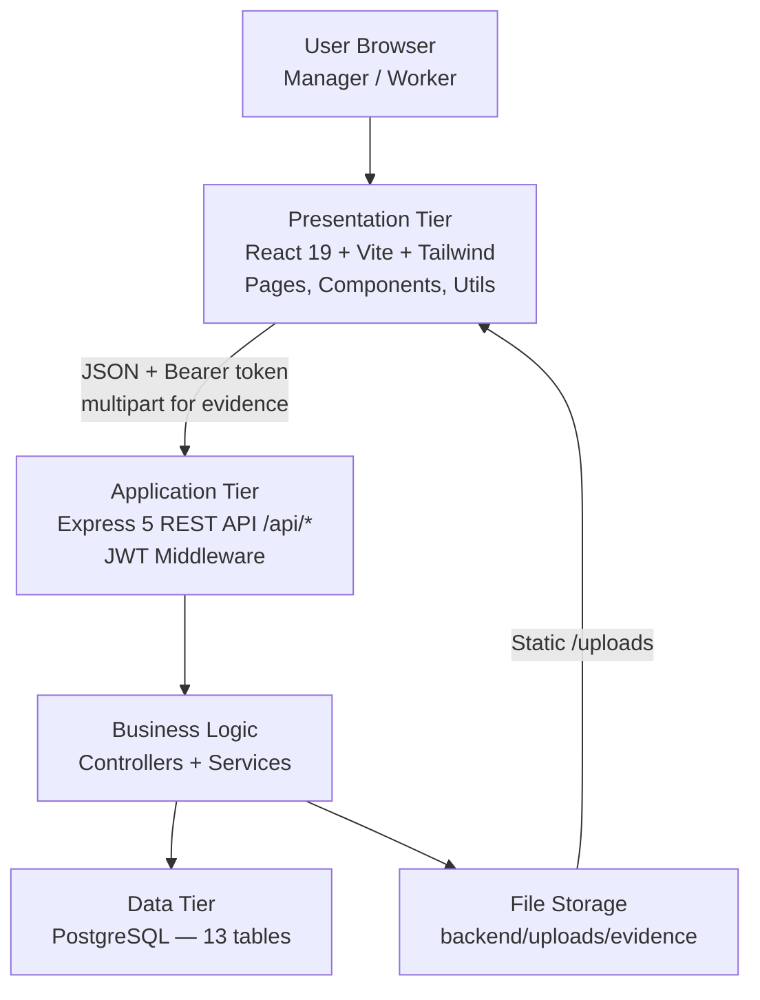
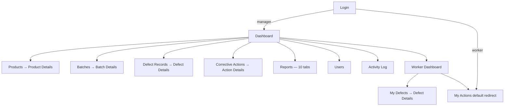
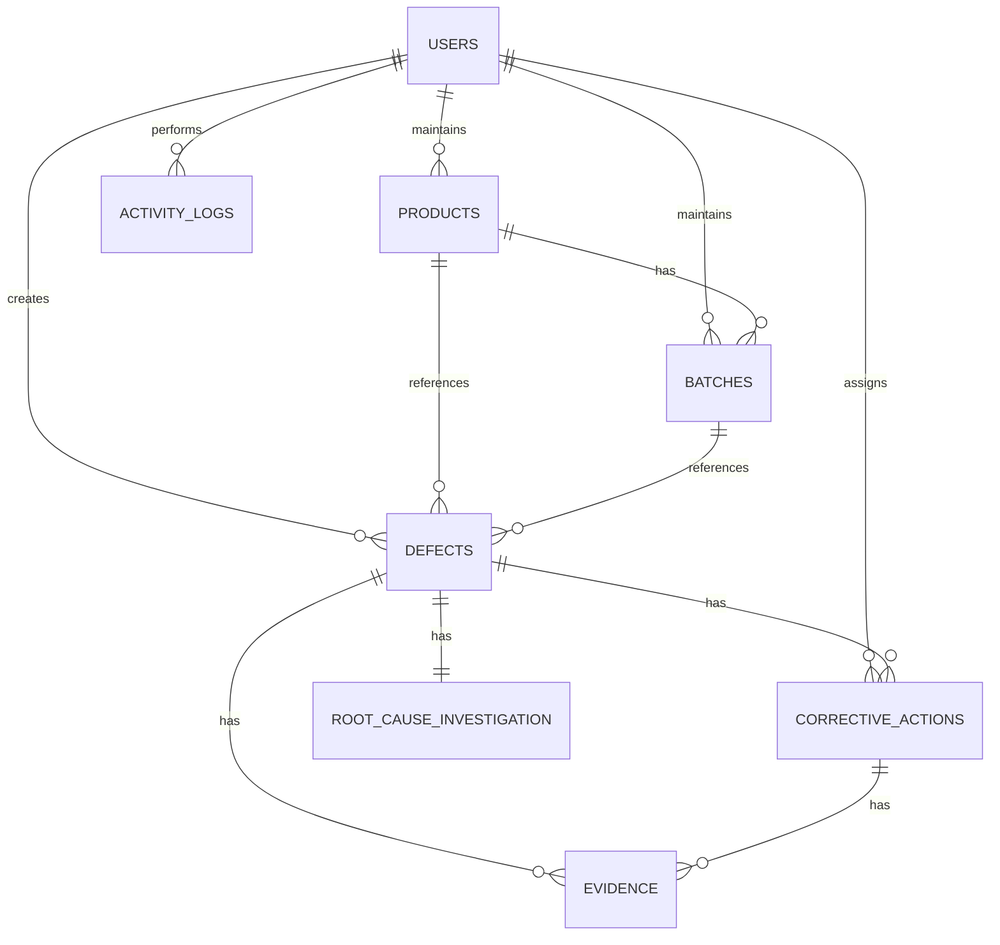
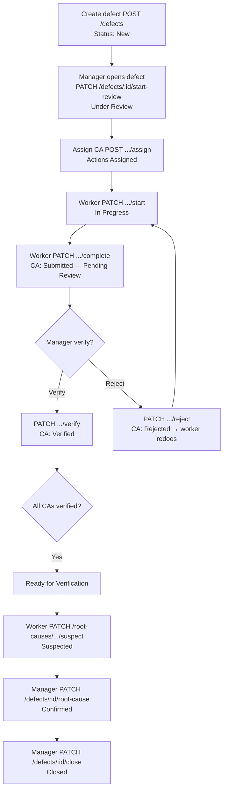

# CHAPTER 4: DESIGN

## 4.1 Introduction

Chapter 3 defined the analysis and requirements for the **Quality Defect Tracking System (QDTS)** implemented as a web prototype for Kak Norie / Retort Niaga. This chapter presents the **system design** that satisfies those requirements: architecture, user interface, database logical model, software modules, and physical database implementation.

All design descriptions in this chapter are based on the **running prototype** only—`frontend/src/`, `backend/src/`, and `backend/database/schema.sql`. The system name used throughout is **QDTS** (not internal version labels). Export outputs are **CSV download** and **browser print / save-as-PDF** via the print dialog; the prototype does **not** generate native PDF or Excel files on the server.

Software and hardware platform choices are documented in Chapter 2 (Section 2.4). Functional requirements, workflow labels, and thirteen stored entities are documented in Chapter 3 (Section 3.3). This chapter focuses on **how** those requirements are designed and structured in the implemented system.

---

## 4.2 High-Level Design

### 4.2.1 System Architecture

QDTS adopts a **three-tier client–server architecture**: a React single-page application (presentation tier), an Express REST API (application tier), and PostgreSQL with local file storage for evidence (data tier). There is no microservice layer, message broker, or separate authentication server.

**Figure 4.1 — Three-tier system architecture**



**Table 4.1 — Architecture layers and responsibilities**

| Layer | Location | Responsibility |
|-------|----------|----------------|
| Presentation | `frontend/src/` | Routing, forms, dashboards, reports, notifications, role-based UI |
| API gateway | `backend/src/routes/index.js` | Route mounting, `requireAuth` after login |
| Authentication | `middleware/auth.js` | JWT sign/verify (8-hour session) |
| Access control | `utils/accessControl.js` | Manager/worker guards, worker data scoping |
| Controllers | `controllers/*.js` | HTTP handlers, transactions, activity logging |
| Services | `services/*.js` | Batch expiry, defect rules, loss calculation, root cause confirmation |
| Data | `database/schema.sql` | Relational storage, CHECK constraints, indexes |
| File storage | `uploads/evidence/` | Evidence images (JPG/PNG/WEBP, max 5 MB) |

**Table 4.2 — Technology stack (implemented)**

| Tier | Technology | Role |
|------|------------|------|
| Frontend | React 19, Vite 8, Tailwind CSS, React Router, Axios, Recharts | SPA UI |
| Backend | Node.js, Express 5, jsonwebtoken, bcrypt, Multer, pg | REST API |
| Database | PostgreSQL | Persistent data |
| Development | localhost `:5173` (frontend), `:3000` (API) | Prototype demo |

Full version and tool lists are in Chapter 2 (Table 2.5).

#### Static view (OOAD)

The static view describes the main domain classes and their relationships. Core classes are **User**, **Product**, **Batch**, **Defect**, **CorrectiveAction**, **RootCauseInvestigation**, **Evidence**, and **ActivityLog**. A user may create or manage defects and corrective actions depending on role. A product has many batches; each batch may have many defects. Each defect has one root cause investigation record and may have many corrective actions and evidence files.

**Figure 4.8 — High-level class diagram (static view)**

*Diagram file:* `PSM/diagrams/figure-4-9-high-level-class-diagram.png` (source: `class-diagram-qdts-high-level.svg`)

#### Dynamic view (OOAD)

The dynamic view shows interaction between actors and system components during the defect lifecycle: report defect → start review → assign corrective action → worker complete → manager verify/reject → suspected root cause → confirm root cause → close defect. Each step uses the REST API (`DefectController`, `CorrectiveActionController`) and PostgreSQL.

**Figure 4.9 — Sequence diagram of defect lifecycle (dynamic view)**

*Diagram file:* `PSM/diagrams/figure-4-10-sequence-diagram-defect-lifecycle.png` (source: `sequence-diagram-defect-lifecycle.mmd`)

**Workflow statuses (system display labels)**

Defect workflow (Chapter 3, Table 3.10):

**New → Under Review → Actions Assigned → In Progress → Ready for Verification → Closed**

Corrective action workflow:

**Assigned → In Progress → Submitted — Pending Review → Verified / Rejected / Cancelled**

*(Database value `completed` is displayed as **Submitted — Pending Review** in the UI.)*

Root cause workflow:

**Pending Investigation → Suspected → Confirmed**

Defect status is **automatically updated** when corrective actions change (`refreshDefectStatus()` in `correctiveActionController.js`).

---

### 4.2.2 User Interface Design

The QDTS interface is a responsive web application with a **left sidebar** (collapsible on desktop, hamburger menu on mobile), top header with notification bell, and role-specific menus defined in `AppShell.jsx`. Workers who navigate to manager-only URLs are redirected to **My Actions** (`/corrective-actions`) by `RequireRole.jsx`.

#### (a) Navigation Design

**Manager menu:** Dashboard, Products, Batches, Defect Records, Corrective Actions, Reports, Users, Activity Log.

**Worker menu:** Dashboard, My Defects, My Actions.

**Figure 4.2 — Navigation flow**

*Diagram file:* `PSM/diagrams/navigation-flow-qdts.svg`



**Deep links (implemented):**

| URL | Behaviour |
|-----|-----------|
| `/reports?tab=expiry` | Opens Reports tab **Expiry Issues** |
| `/corrective-actions?filter=overdue` | Filters overdue actions (legacy param; `?caDue=overdue` also supported) |
| `/defects/:id?tab=root-cause` | Opens Defect Details **Root Cause** tab |

**Table 4.3 — Page inventory**

| Page | Route | Role | Purpose |
|------|-------|------|---------|
| Login | (pre-auth) | All | Authenticate with username and password |
| Dashboard | `/` | Both | Role-specific KPIs, charts, attention lists |
| Products | `/products` | Manager | Product catalogue; add/edit/archive |
| Product Details | `/products/:id` | Manager | Single product with batches and defects |
| Batches | `/batches` | Manager | Batch register; add/edit |
| Batch Details | `/batches/:id` | Manager | Batch traceability, linked defects and CAs |
| Defect Records / My Defects | `/defects` | Both | Defect list; report/add defect |
| Defect Details | `/defects/:id` | Both | Overview, Actions, Root Cause, Activity tabs |
| Corrective Actions / My Actions | `/corrective-actions` | Both | CA register with filters and CSV export |
| Corrective Action Details | `/corrective-actions/:id` | Both | Start, complete, verify, reject, evidence |
| Reports | `/reports` | Manager | Ten analytical tabs with period filter |
| Users | `/users` | Manager | Active user list; add user only |
| Activity Log | `/activity-log` | Manager | Paginated audit trail with CSV/print |

**Table 4.4 — Navigation controls**

| Control | Location | Function |
|---------|----------|----------|
| Sidebar link | Left panel | Primary module navigation |
| Hamburger menu | Top header (mobile) | Open/close sidebar |
| Notification bell | Top header | Deep links to overdue CAs, new defects, expiry mismatches |
| KPI card | Dashboard | Drill-down to filtered lists |
| Tab pills | Reports, Defect Details | Switch sub-views |
| Row action button | Tables | Open detail pages |

**Recommended screenshots**

| Figure | Title | File (capture to `PSM/screenshots/`) |
|--------|-------|--------------------------------------|
| 4.3 | Manager sidebar | `fig-4-3-manager-sidebar.png` |
| 4.4 | Worker sidebar | `fig-4-4-worker-sidebar.png` |

---

#### (b) Input Design

Input screens use text fields, number fields, date pickers, dropdowns, text areas, and file upload controls. **Client-side** validation runs before submit; **server-side** validation in controllers enforces business rules and role permissions.

**Login uses username and password** (not email login). Email is stored on user records but is not the login identifier.

**Defect reporting — two flows**

| Actor | Steps | Form labels |
|-------|-------|-------------|
| Worker | 2 steps: What & Where → Details & Photo | **Report Defect** |
| Manager | 3 steps: Product Information → Defect Information → Evidence & Initial Suggestions | **Add Defect** |

**Table 4.5 — Input fields and validation rules**

| Screen / Form | Field | Type | Required? | Validation / business rule |
|---------------|-------|------|-----------|----------------------------|
| Login | Username | Dropdown (demo) / text | Yes | Active user; bcrypt password verify |
| Login | Password | Password | Yes | Required |
| Add User | Username | Text | Yes | `[a-z0-9_]+`; unique |
| Add User | Email | Email | Yes | Valid format; unique |
| Add User | Full name | Text | Yes | Non-empty |
| Add User | Role | Select | Yes | `manager` or `worker` |
| Add User | Password | Password | Yes | Minimum 6 characters |
| Add User | Account status | Select | No | `active` or `inactive`; default active |
| Add / Edit Product | Product name | Text | Yes | Non-empty |
| Add / Edit Product | Category, packaging, size | Dropdown | Yes | Predefined lists |
| Add / Edit Product | Shelf life (months) | Number | Yes | > 0 |
| Add / Edit Product | Loss rate per unit | Number | Yes | ≥ 0 |
| Add / Edit Product | Storage condition | Dropdown | No | Optional on server |
| Add / Edit Product | Description | Text area | No | Optional |
| Add / Edit Product | Product code | Read-only | — | Auto-generated on create; not editable |
| Add / Edit Batch | Product | Dropdown | Yes | Must exist |
| Add / Edit Batch | Production date | Date | Yes | Required |
| Add / Edit Batch | Retort date | Date | Yes | ≥ production date |
| Add / Edit Batch | Printed expiry date | Date | Yes | Compared to system correct expiry |
| Add / Edit Batch | Quantity produced | Number | Yes | > 0 |
| Add / Edit Batch | Notes | Text area | No | Optional |
| Report Defect Step 1 | Product, batch | Dropdown | Yes | Batch must belong to product |
| Report Defect Step 1 | Detected stage | Dropdown | Yes | One of nine stages (Section 3.3.2) |
| Report Defect Step 1 | Defect type | Dropdown | Yes | Filtered by stage; validated against `defect_type_mappings` |
| Report Defect Step 1 | Defect type other | Text | If type = Other | Required when Other selected |
| Report Defect Step 1 | Qty affected | Number | Yes | > 0 and ≤ batch quantity produced |
| Report Defect Step 2 | Description | Text area | Yes | Non-empty |
| Report Defect Step 2 | Priority | Select | Yes | If `urgent`, urgency reason required |
| Report Defect Step 2 | Review due date | Date | No | Cannot be before today if set |
| Report Defect Step 2 | Photo evidence | File | No | JPG/PNG/WEBP ≤ 5 MB; uploaded after create |
| Add Defect Step 3 (manager) | Suggested product handling | Dropdown | Yes | From workflow rule options |
| Add Defect Step 3 (manager) | Suggested machine handling | Dropdown | Yes | From workflow rule options |
| Add Defect Step 3 (manager) | Related tool / machine | Dropdown | Yes | From workflow rule options |
| Add Defect Step 3 (manager) | Handling notes | Text area | No | Optional |
| Assign Corrective Action | Action type | Dropdown | Yes | `product_handling` or `machine_process_check` |
| Assign Corrective Action | Task | Dropdown / custom text | Yes | From rule options or Custom Task |
| Assign Corrective Action | Assigned to | Dropdown | Yes | Active worker user |
| Assign Corrective Action | Due date | Date | No | Editable later by manager |
| Assign Corrective Action | Evidence required | Checkbox | No | Blocks complete/verify without upload |
| Assign Corrective Action | Priority | Dropdown | No | Default `medium` on server |
| Complete Corrective Action | Investigation finding | Text area | Yes | Non-empty |
| Complete Corrective Action | Action taken | Text area | Yes | Non-empty |
| Complete Corrective Action | Handling quantities | Number | No | Each ≥ 0; **cumulative handled ≤ qty affected** |
| Complete Corrective Action | Evidence file | File | If required | At least one image when `evidence_required` |
| Reject Corrective Action | Rejection reason | Text area | Yes | Manager only |
| Suspected Root Cause | Suspected cause | Dropdown | Yes | Worker with defect access |
| Suspected Root Cause | Investigation notes | Text area | No | Optional |
| Confirm Root Cause | Confirmed cause | Dropdown | Yes | Manager; all CAs must be verified first |
| Edit CA due date | Due date | Date | Yes | Blocked if defect closed or CA verified |

**Recommended screenshots (input forms)**

| Figure | Title | File |
|--------|-------|------|
| 4.5 | Login form | `fig-4-5-login.png` |
| 4.6 | Add product form | `fig-4-6-add-product.png` |
| 4.7 | Add batch form | `fig-4-7-add-batch.png` |
| 4.8 | Report defect form (worker) | `fig-4-8-report-defect-worker.png` |
| 4.9 | Assign corrective action | `fig-4-9-assign-action.png` |

---

#### (c) Output Design

QDTS outputs include on-screen summaries, detail lists, charts, audit logs, CSV downloads, and printable HTML summaries (browser print / save-as-PDF).

**Table 4.6 — Output design classification**

| Output | Description | Type | Frequency |
|--------|-------------|------|-----------|
| Dashboard (manager) | KPI cards, defect trend chart, actions by status, attention centre | Summary / graph | On-demand; default period this month |
| Dashboard (worker) | My reports, assigned actions, overdue alerts | Summary | On-demand |
| Defect list | Filterable table with status badges | Detail list | On-demand; CSV export |
| Defect details | Tabs: overview, actions, root cause, activity; print summary | Detail | On-demand |
| Corrective action list | Filterable table; CSV export | Detail list | On-demand |
| Batch / product details | Traceability and linked records | Detail | On-demand |
| Reports (10 tabs) | Loss, root cause, expiry, by product/batch, etc. | Analytical | On-demand; period filter |
| Batch expiry audit | All batches where printed ≠ correct expiry | Audit report | On-demand |
| Activity log | Paginated user actions | Audit | On-demand; CSV and print |
| In-app notifications | Bell panel (max 8 items shown) | Alert | Evaluated on page load |
| Print summary | Defect or CA case summary | Turnaround document | On-demand; browser print |
| Export CSV | Report or list download | Turnaround document | On-demand |

Reports tabs (implemented in `Reports.jsx`): Overview, Loss, Root Cause, By Detection Stage, Root Cause Area, Process / Tool, Expiry Issues, Discarded Products, By Product, By Batch.

**Recommended screenshots (output)**

| Figure | Title | File |
|--------|-------|------|
| 4.10 | Manager dashboard | `fig-4-10-dashboard-manager.png` |
| 4.11 | Defect list | `fig-4-11-defect-list.png` |
| 4.12 | Defect details | `fig-4-12-defect-details.png` |
| 4.13 | Reports page | `fig-4-13-reports.png` |
| 4.14 | Activity log | `fig-4-14-activity-log.png` |

---

### 4.2.3 Database Design

#### 4.2.3.1 Conceptual and Logical Database Design

The logical data model (LDM) describes what data the system stores and how entities relate. The physical schema defines **thirteen tables** (Chapter 3, Table 3.7). The **core transactional ERD** in this section shows **eight entities**; lookup and configuration tables (`defect_types`, `defect_type_mappings`, `root_causes`, `defect_workflow_rules`, `defect_workflow_options`) support dropdowns and validation but are omitted from the core diagram for readability. The full ERD is in `PSM/diagrams/erd-qdts-full.svg`.

**Figure 4.15 — Core logical ERD**

*Diagram file:* `PSM/diagrams/erd-qdts-core-report.svg`



**Table 4.7 — Entity relationships and business rules**

| Parent | Child | Cardinality | FK | Business rule |
|--------|-------|-------------|-----|---------------|
| `products` | `batches` | 1 : M | `batches.product_id` | Each batch belongs to one product; correct expiry = retort date + product shelf life |
| `products` | `defects` | 1 : M | `defects.product_id` | Defect linked to product for reporting; names joined at query time |
| `batches` | `defects` | 1 : M | `defects.batch_id` | Defect tied to one batch; batch dates not duplicated on defect row |
| `defects` | `root_cause_investigation` | 1 : 1 | `defect_id` UNIQUE | Row created at defect report; status Pending → Suspected → Confirmed |
| `defects` | `corrective_actions` | 1 : M | `corrective_actions.defect_id` | Multiple CAs per defect; ON DELETE CASCADE |
| `defects` | `evidence` | 1 : M | `evidence.defect_id` | Optional defect-level photos |
| `corrective_actions` | `evidence` | 1 : M | `evidence.corrective_action_id` | CA completion evidence |
| `users` | `defects` | 1 : M | `created_by`, `closed_by` | Accountability for report and closure |
| `users` | `corrective_actions` | 1 : M | `assigned_to`, `assigned_by`, etc. | Separation of assign, execute, verify |
| `users` | `activity_logs` | 1 : M | `activity_logs.user_id` | Append-only audit trail |

**Design decisions**

1. **Batch owns dates and quantity** — production, retort, correct/printed expiry, and quantity produced live on `batches` only.
2. **Product owns shelf life and loss rate** — `loss_rate_per_unit` may be copied to `defects` as a snapshot at report time.
3. **Defect type as text** — `defects.defect_type` stores the type name; `defect_type_mappings` validates stage combinations on insert.
4. **Root cause deferred** — investigation is 1:1 in `root_cause_investigation`, not overloaded on `defects`.
5. **Products archive only** — no delete API; preserves traceability.

**Table 4.8 — Data dictionary (core columns)**

| Table | Key columns | Notes |
|-------|-------------|-------|
| `users` | `id` PK, `username` UNIQUE, `email` UNIQUE, `role`, `account_status`, `password_hash` | Login by username |
| `products` | `id` PK, `product_code` UNIQUE, `shelf_life_months`, `loss_rate_per_unit`, `product_status` | Code auto-generated |
| `batches` | `id` PK, `batch_number` UNIQUE, `product_id` FK, `retort_date`, `correct_expiry_date`, `printed_expiry_date`, `quantity_produced` | Batch number `{code}-B-{YYYYMMDD}` |
| `defects` | `id` PK, `defect_code` UNIQUE, `product_id`, `batch_id`, `detected_at_stage`, `defect_type`, `defect_status`, `qty_affected` | Nine stages; no Cooling stage |
| `root_cause_investigation` | `id` PK, `defect_id` UNIQUE FK, `root_cause_status`, suspected/confirmed fields | Worker suspect; manager confirm |
| `corrective_actions` | `id` PK, `action_code` UNIQUE, `defect_id` FK, `ca_status`, `assigned_to`, `due_date`, `calculated_loss` | Includes `cancelled` status |
| `evidence` | `id` PK, `defect_id`, `corrective_action_id`, `file_name`, `uploaded_by` | Metadata; files on disk |
| `activity_logs` | `id` PK, `user_id`, `action_type`, `entity_type`, `entity_id`, `description` | e.g. START_REVIEW, CLOSE_DEFECT |

Full column definitions are in `backend/database/schema.sql`.

**Normalization**

All thirteen tables satisfy **Third Normal Form (3NF)**: atomic columns, single-column surrogate primary keys, and foreign keys instead of redundant descriptive fields. Controlled denormalization: `defects.loss_rate_per_unit` snapshots the product rate at report time for historical loss accuracy.

---

## 4.3 Detailed Design

### 4.3.1 Software Design

Request flow: **Route → Controller → Service (optional) → PostgreSQL**. Mutating operations use **BEGIN/COMMIT** transactions where multiple tables must stay consistent (create defect, assign CA, confirm root cause, close defect).

**Figure 4.16 — Defect lifecycle activity flow**



**Table 4.9 — API route catalogue**

| Module | Method | Path | Role | Purpose |
|--------|--------|------|------|---------|
| Health | GET | `/api/health` | Public | API status |
| Auth | POST | `/api/auth/login` | Public | Issue JWT |
| Auth | GET | `/api/auth/me` | Auth | Current user |
| Products | GET/POST | `/api/products` | Read: all; Write: manager | List / create |
| Products | GET/PUT | `/api/products/:id` | Read: all; Write: manager | Detail / update |
| Products | PATCH | `/api/products/:id/archive` | Manager | Archive product |
| Batches | GET/POST | `/api/batches` | Read: all; Write: manager | List / create |
| Batches | GET/PUT | `/api/batches/:id` | Manager write | Detail / update |
| Batches | GET | `/api/batches/:id/defects`, `.../corrective-actions` | Auth | Batch traceability |
| Defects | GET/POST | `/api/defects` | Auth | List (worker scoped) / create |
| Defects | GET | `/api/defects/rules/*`, `/options/*` | Auth | Stages, types, workflow rules |
| Defects | GET/PATCH | `/api/defects/:id`, `start-review`, `root-cause`, `close` | Mixed | Detail, review, confirm RC, close |
| Defects | POST | `/api/defects/:id/evidence` | Auth | Upload defect evidence |
| Defects | GET | `/api/defects/:id/activity` | Auth | Per-defect timeline |
| Corrective actions | GET | `/api/corrective-actions` | Auth | List (worker scoped) |
| Corrective actions | POST | `/api/corrective-actions/defects/:defectId/assign` | Manager | Assign CA |
| Corrective actions | PATCH | `/api/corrective-actions/:id/start` | Worker | Start CA |
| Corrective actions | PATCH | `/api/corrective-actions/:id/complete` | Worker | Submit completion |
| Corrective actions | PATCH | `/api/corrective-actions/:id/verify`, `reject`, `cancel` | Manager | Verify / reject / cancel |
| Corrective actions | PATCH | `/api/corrective-actions/:id/due-date` | Manager | Edit due date |
| Corrective actions | POST | `/api/corrective-actions/:id/evidence` | Worker (assigned) | Upload CA evidence |
| Root causes | GET | `/api/root-causes/defects/:defectId` | Auth | Get investigation |
| Root causes | PATCH | `/api/root-causes/defects/:defectId/suspect` | Worker | Record suspected RC |
| Root causes | PATCH | `/api/root-causes/defects/:defectId/confirm` | Manager | Confirm RC (alternate path) |
| Reports | GET | `/api/reports/*` (11 endpoints) | Manager | Dashboard summary, loss, expiry, etc. |
| Users | GET/POST | `/api/users` | Manager | List active users / add user |
| Activity logs | GET | `/api/activity-logs` | Manager | Paginated audit log |

**Table 4.10 — Controllers and services**

| Module | File | Purpose |
|--------|------|---------|
| `authController` | Login, session user | JWT + bcrypt |
| `userController` | List users, create user | Manager-only; no edit/deactivate UI |
| `productController` | CRUD, archive, auto product code | Manager write |
| `batchController` | CRUD, batch defects/CAs, expiry meta | Manager write |
| `defectController` | Defect CRUD, rules, review, RC confirm, close, evidence | Core workflow |
| `correctiveActionController` | CA lifecycle, defect status sync, evidence | Assign through cancel |
| `rootCauseController` | Get/suspect/confirm investigation | Worker suspect path |
| `reportController` | Aggregated analytics with period filters | Manager only |
| `activityLogController` | Paginated logs | Manager only |
| `batchService` | Batch number, expiry calculation, date validation | |
| `defectRuleService` | Stage/type mappings, workflow rules | |
| `lossService` | Loss calculation, qty validation, loss status | |
| `rootCauseService` | Confirm RC business rules | Blocks until CAs verified |
| `correctiveActionService` | Status explanation text | |

**Table 4.11 — Frontend modules (selected)**

| File | Responsibility |
|------|----------------|
| `App.jsx` | Session restore, routing |
| `AppShell.jsx` | Sidebar, notifications, logout |
| `Dashboard.jsx` | Role KPIs, charts, attention centre |
| `Defects.jsx` / `DefectDetails.jsx` | List, multi-step forms, workflow tabs |
| `CorrectiveActions.jsx` / `CorrectiveActionDetails.jsx` | CA queue and completion |
| `Reports.jsx` | Ten report tabs, CSV/print export |
| `utils/defectWorkflow.js` | Phase/blocker logic for manager UI |
| `utils/notifications.js` | Bell notification builder |
| `utils/expiry.js` | Expiry mismatch detection |
| `utils/printDocument.js` | Hidden iframe browser print |
| `utils/reportExport.js` | CSV download; print HTML for reports |

**Algorithms (implemented)**

*Expiry mismatch*

```
mismatch = (correct_expiry_date ≠ printed_expiry_date) for the linked batch
```

*Loss on corrective action complete*

```
calculated_loss = qty_discarded × loss_rate_per_unit (per action)
defect.estimated_loss updated cumulatively from verified actions
```

*Loss status on defect close*

```
if qty_discarded > 0 and defect closed → loss_status = loss_confirmed
else if qty_discarded = 0 → loss_status = no_loss
```

*Handled quantity validation*

```
sum(qty_relabelled, qty_repacked, qty_reworked, qty_released, qty_discarded) ≤ qty_affected
```

---

### 4.3.2 Physical Database Design

**DBMS:** PostgreSQL  
**DDL:** `backend/database/schema.sql`  
**Seed data:** `backend/database/seed.sql`, `seed_workflow_rules.sql`  
**Incremental migrations:** `backend/database/2026_06_*.sql`

**Table 4.12 — Thirteen physical tables**

| # | Table | Primary key |
|---|-------|-------------|
| 1 | `users` | `id` SERIAL |
| 2 | `products` | `id` SERIAL |
| 3 | `batches` | `id` SERIAL |
| 4 | `defect_types` | `id` SERIAL |
| 5 | `defect_type_mappings` | `id` SERIAL |
| 6 | `root_causes` | `id` SERIAL |
| 7 | `defects` | `id` SERIAL |
| 8 | `root_cause_investigation` | `id` SERIAL |
| 9 | `corrective_actions` | `id` SERIAL |
| 10 | `evidence` | `id` SERIAL |
| 11 | `activity_logs` | `id` SERIAL |
| 12 | `defect_workflow_rules` | `id` SERIAL |
| 13 | `defect_workflow_options` | `id` SERIAL |

**Constraints**

- **UNIQUE:** `users.username`, `users.email`, `products.product_code`, `batches.batch_number`, `defects.defect_code`, `corrective_actions.action_code`, `root_cause_investigation.defect_id`
- **CHECK:** Role, account status, product/batch/defect/CA/root-cause/loss status enums; positive quantities; `retort_date ≥ production_date`
- **ON DELETE CASCADE:** `root_cause_investigation`, `corrective_actions`, and `evidence` when parent defect/action deleted; `defect_workflow_options` when rule deleted

**Indexes** (named in schema, lines 395–421)

| Index | Columns | Purpose |
|-------|---------|---------|
| `idx_products_status` | `product_status` | Filter active products |
| `idx_batches_product_id` | `product_id` | Batches by product |
| `idx_batches_retort_date` | `retort_date` | Sort/filter by production |
| `idx_defects_product_id`, `batch_id`, `status`, `created_at`, `review_due_date` | Various | List and dashboard queries |
| `idx_corrective_actions_defect_id`, `assigned_to`, `status`, `due_date` | Various | Worker queue, overdue |
| `idx_activity_logs_user_id`, `entity`, `created_at` | Various | Audit log queries |

UNIQUE constraints on `defect_code` and `batch_number` also create implicit indexes in PostgreSQL.

**File storage**

Evidence files are stored under `backend/uploads/evidence/` with metadata in the `evidence` table (`file_name`, `file_path`, `uploaded_by`). Static files are served at `/uploads/...`.

**Data integrity rules (enforced in application layer)**

1. Defect type must match detected stage (`defectRuleService.isValidStageTypeMapping`).
2. Cannot assign CA to closed defect.
3. Cannot confirm root cause until all non-cancelled CAs are verified.
4. Cannot close defect until root cause confirmed and all CAs verified.
5. Evidence required flag enforced on complete and verify.
6. Rejected CA rolls back quantity contributions on the parent defect.
7. Worker list endpoints scoped to created defects or assigned CAs only.

---

## 4.4 Conclusion

This chapter presented the design of **QDTS** based on Chapter 3 requirements and the implemented prototype. The three-tier architecture (React, Express, PostgreSQL) separates presentation, business logic, and data storage. The user interface provides role-specific navigation, guided input forms, dashboards, ten report tabs, CSV export, and browser-print summaries. The database design uses thirteen normalized tables with foreign-key traceability from product through batch, defect, corrective action, and root cause investigation.

The design **supports** batch traceability, corrective action monitoring, expiry mismatch reporting, and audit logging identified in the requirement analysis. Implementation, testing evidence, and deployment discussion are presented in subsequent report chapters.

---

## FINAL LIST — DIAGRAMS FOR CHAPTER 4

| Figure | Title | Section | Source |
|--------|-------|---------|--------|
| **4.1** | Three-tier system architecture | 4.2.1 | Mermaid in this chapter; optional `PSM/diagrams/architecture-qdts-three-tier.svg` |
| **4.2** | Navigation flow | 4.2.2(a) | `PSM/diagrams/figure-4-2-navigation-flow.png` |
| **4.3** | Login form | 4.2.2(b) | `PSM/screenshots/fig-4-5-login.png` |
| **4.4** | Report defect form (worker) | 4.2.2(b) | `PSM/screenshots/fig-4-8-report-defect-worker.png` |
| **4.5** | Manager dashboard | 4.2.2(c) | `PSM/screenshots/fig-4-10-dashboard-manager.png` |
| **4.6** | Defect details | 4.2.2(c) | `PSM/screenshots/fig-4-12-defect-details.png` |
| **4.7** | Core logical ERD | 4.2.3.1 | `PSM/diagrams/figure-4-15-core-entity-relationship-diagram.png` |
| **4.8** | High-level class diagram (static view) | 4.2.1 | `PSM/diagrams/figure-4-9-high-level-class-diagram.png` |
| **4.9** | Sequence diagram (dynamic view) | 4.2.1 | `PSM/diagrams/figure-4-10-sequence-diagram-defect-lifecycle.png` |
| **4.10** | Defect lifecycle activity flow | 4.3.1 | `PSM/diagrams/figure-4-16-defect-lifecycle-activity.png` |

*Optional appendix:* full ERD (`erd-qdts-full.svg`), use case diagram (`use-case-qdts.svg`), sequence diagram (`sequence-diagram-defect-lifecycle.mmd`).

**Screenshot capture:** run frontend and backend locally, then `cd frontend && npm run screenshots` (see `PSM/screenshots/README.md`).

---

## FINAL LIST — TABLES FOR CHAPTER 4

| Table | Title | Section |
|-------|-------|---------|
| **4.1** | Architecture layers and responsibilities | 4.2.1 |
| **4.2** | Technology stack (implemented) | 4.2.1 |
| **4.3** | Page inventory | 4.2.2(a) |
| **4.4** | Navigation controls | 4.2.2(a) |
| **4.5** | Input fields and validation rules | 4.2.2(b) |
| **4.6** | Output design classification | 4.2.2(c) |
| **4.7** | Entity relationships and business rules | 4.2.3.1 |
| **4.8** | Data dictionary (core columns) | 4.2.3.1 |
| **4.9** | API route catalogue | 4.3.1 |
| **4.10** | Controllers and services | 4.3.1 |
| **4.11** | Frontend modules (selected) | 4.3.1 |
| **4.12** | Thirteen physical tables | 4.3.2 |

*Cross-reference:* workflow UI labels — Chapter 3, Table 3.10; functional requirements — Chapter 3, Table 3.3; thirteen entities — Chapter 3, Table 3.7.
